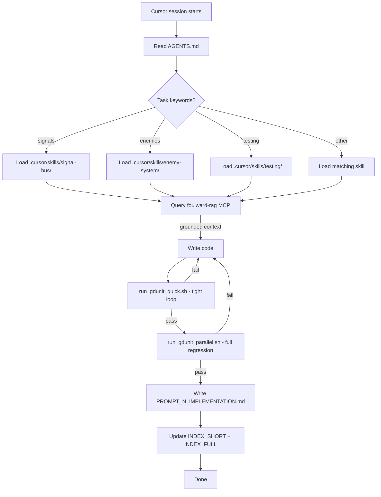
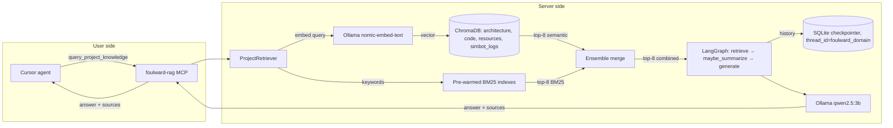
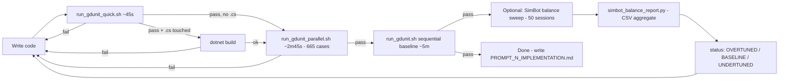
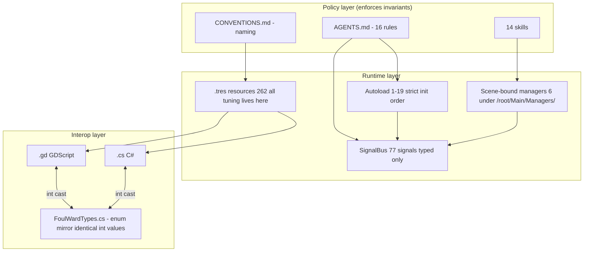
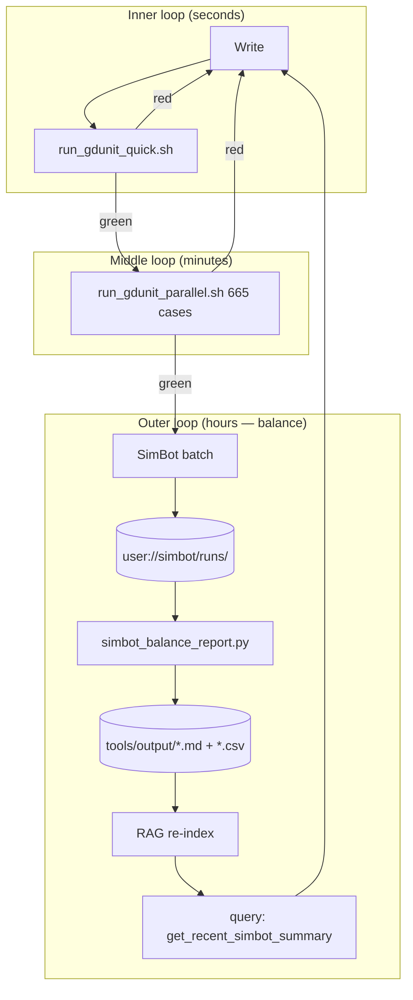

# Foul Ward — How It Works

> A walkthrough of the engineering infrastructure, automation, and AI-augmented
> workflow that sits around a Godot 4.6 tower-defence game.
> Written to supplement my CV. Every claim here is verifiable from files in
> this repo — file paths are real, the numbers come from `grep`, `wc -l`, or
> the GdUnit4 test runner output.
>
> **Last repo snapshot referenced:** 2026-04-20.
> **Current metrics:** 19 core autoloads · 77 `SignalBus` signals · 665 GdUnit4
> test cases (parallel aggregate) · 88 test files · 262 `.tres` resources ·
> 36 building types · 30 enemy types · 14 Cursor skills · 6 MCP servers ·
> 4 GdUnit4 runner tiers · **90** `PROMPT_*_IMPLEMENTATION.md` files (`find docs docs/archived/prompts -maxdepth 1 -name 'PROMPT_*_IMPLEMENTATION.md'` — numbers **`PROMPT_0`…`PROMPT_89`**); **10** live in `docs/` as **`PROMPT_80`…`PROMPT_89`**; **`PROMPT_1_IMPLEMENTATION_v2.md`** archived separately; full history in `docs/archived/prompts/`.

---

## Reading guide

| If you have… | Read… |
|---|---|
| 2 minutes | [§ TL;DR](#tldr-2-minutes) |
| 10 minutes | [§ TL;DR](#tldr-2-minutes) + [§ 1 Executive summary](#1-executive-summary) |
| 30 minutes | Everything up to [§ 5 Architecture as policy](#5-architecture-as-policy) |
| A full read | All sections; [§ 9 Trade-offs](#9-trade-offs--what-id-change) and [§ 10 Numbers](#10-numbers-at-a-glance) are the interview hooks |

The companion [`INTERVIEW_CHEATSHEET.md`](INTERVIEW_CHEATSHEET.md) distils this
down to a one-page talking-points card.

---

## TL;DR (2 minutes)

Foul Ward is a solo-developed, AI-augmented tower-defence game in Godot 4.6.
The game itself is the *artefact*; the interesting work is the **engineering
scaffolding I built around a coding agent** so that I could let an LLM write
most of the gameplay code without the codebase collapsing into spaghetti.

The scaffolding has seven layers:

1. **A standing-orders file** (`AGENTS.md`, symlinked as `.cursorrules`) that
   the agent reads at the start of every session — the machine-readable
   contract for how this codebase is allowed to be touched.
2. **14 domain-scoped "skills"** under `.cursor/skills/` that are loaded
   on-demand when the agent starts working on a specific system (signals,
   economy, enemies, testing, etc.). This keeps the agent's working context
   small and relevant.
3. **6 MCP (Model Context Protocol) servers** wired into Cursor — including a
   bespoke **`foulward-rag`** server I wrote in Python that indexes the whole
   project into ChromaDB and answers questions about it with hybrid BM25 +
   semantic retrieval, so the agent queries ground truth instead of
   hallucinating.
4. **A four-tier GdUnit4 test pipeline** (quick / unit / parallel / sequential
   baseline) with explicit exit-code semantics and a known-quirk tolerance
   table, so a red test always means a *real* regression.
5. **A headless simulation harness** (`AutoTestDriver` + `SimBot`) that lets
   me run full missions without a UI, at batch scale, and dumps CSV telemetry
   that a Python aggregator turns into an "OVERTUNED / BASELINE / UNDERTUNED"
   report per building.
6. **A structural architecture** — 19 autoloads in a strict init order, all
   cross-system events routed through a single `SignalBus`, all gameplay
   numbers in `.tres` resources (no magic numbers in code) — deliberately
   *boring and uniform* so that AI-introduced drift shows up on diff.
7. **A local generative-3D pipeline** (`tools/gen3d/`) — ComfyUI + FLUX.1-dev
   + TRELLIS.2 + Blender + Mixamo — that turns a single prompt line into a
   rigged, animated `.glb` placeholder on disk.

The game is the *demonstration surface*. The interview story is: **I applied
release-engineering habits (standardised templates, multi-tier testing, exit-code
discipline, audit trails, retrieval-grounded knowledge) to a personal LLM-coded
project, and it scaled to 665 passing tests and ~50 session logs without
collapsing.**

---

## 1. Executive summary

### The problem

LLM-assisted coding at scale has two failure modes:

1. **Hallucination** — the agent invents a function, signal, or enum value
   that doesn't exist and happily writes code against it.
2. **Structural drift** — the agent silently deviates from conventions the
   project used to follow, because no one told it what those conventions are
   in a form it can read.

On a solo project these failures are usually only caught by humans at review
time, and on a hobby project that means they're caught late or never.

### The design response

I treated the agent as an untrusted contributor and built four kinds of
guardrails around it:

| Layer | Purpose | Concrete artefact |
|---|---|---|
| **Policy** | Define the law of the codebase in a way the agent reads every session | `AGENTS.md` (repo root, symlinked as `.cursorrules`) · `.cursor/skills/*/SKILL.md` · `.cursor/rules/mcp-godot-workflow.mdc` |
| **Grounding** | Make it cheap for the agent to *check* ground truth before writing | `foulward-rag` MCP (hybrid BM25 + semantic retrieval over docs, code, `.tres`, and SimBot logs) · `docs/INDEX_SHORT.md` / `INDEX_FULL.md` · `sequential-thinking` MCP |
| **Verification** | Catch bad changes automatically, with a fast inner loop and a thorough outer loop | 4-tier GdUnit4 runners (`tools/run_gdunit_{quick,unit,parallel,.}.sh`) · `AutoTestDriver` headless integration · `SimBot` balance sweep + Python aggregator |
| **Audit** | Keep a human-readable trail of what was changed and why | `docs/PROMPT_[N]_IMPLEMENTATION.md` (rolling window: 10 newest in `docs/`, older in `docs/archived/prompts/`) · `docs/INDEX_SHORT.md` + `INDEX_FULL.md` updated per session · optional local `reports/` (gitignored) for GdUnit logs |

### Result

- **665 GdUnit4 test cases** passing in a parallel run (~2 min 45 s
  wall-clock), verified 2026-04-19 (`docs/archived/prompts/PROMPT_76_IMPLEMENTATION.md`).
- **77 typed cross-system signals** on `SignalBus`, all past-tense snake_case,
  with a single source of truth (`autoloads/signal_bus.gd`) and a mirror
  lookup table (`.cursor/skills/signal-bus/references/signal-table.md`).
- **262 `.tres` resource files** — every piece of gameplay tuning lives in a
  resource the game loads at runtime, not in GDScript constants.
- **Session logs** — **90** `PROMPT_*_IMPLEMENTATION.md` files (`find …`; numbers **`PROMPT_0`…`PROMPT_89`**), plus **`PROMPT_1_IMPLEMENTATION_v2.md`** in the archive; **10** most recent under `docs/` (**`PROMPT_80`…`PROMPT_89`**), older logs in `docs/archived/prompts/`.
- **1 incident** of the signal-count going stale in docs, caught and fixed
  (`docs/archived/prompts/PROMPT_77_IMPLEMENTATION.md`) by a skill rule that forces the writer to
  re-count `^signal ` in `signal_bus.gd` every time they touch a signal and
  update every documented location.

---

## 2. The governance layer

This section covers the artefacts that tell the agent *how* to work in this
repo before it writes a single line of code.

### 2.1 `AGENTS.md` — standing orders

`AGENTS.md` lives at the repo root and is symlinked as `.cursorrules`
(so every Cursor session loads it automatically). It is deliberately short
(~250 lines) because its job is to be read in full, every session.

**What's in it:**

- A one-paragraph **"What"** statement with the current, verified metric
  counts (autoloads, signals, tests, buildings, enemies, hex slots).
- The **autoload init order** as a numbered list, with dependency notes for
  the non-obvious ones (e.g. `CampaignManager` MUST load before `GameManager`
  because the former owns `current_day` and the latter listens to
  `mission_won`).
- **Scene-bound manager paths** that are contracted (e.g. the WaveManager is a
  scene node under `/root/Main/Managers/WaveManager`, not an autoload — and
  `GameManager` silently skips it if absent, for headless safety).
- **How to verify changes** — the four test runners with rough wall-clock
  times, plus the `dotnet build` precondition when `.cs` files change.
- **16 critical rules** — the law: static typing everywhere, signals through
  `SignalBus` only, `get_node_or_null()` + null guard for runtime lookups,
  `is_instance_valid()` before accessing freed-mid-frame objects,
  `push_warning()` not `assert()` in production (because `assert` crashes
  headless test runs), `_physics_process` for gameplay logic / `_process` for
  UI only, etc.
- **Field-name discipline table** — a "wrong → correct" column for the field
  names that the agent most often gets wrong (e.g. `hp` vs `max_hp`,
  `base_damage_min/max` vs a single `damage`). This is the fastest fix for
  the #1 hallucination failure I saw in early sessions.
- **Formally cut features** — named systems the agent must *not* implement
  (e.g. the old "Arnulf drunkenness" feature was cut; `Sybil passive
  selection` is planned but not yet in code). Without this, the agent will
  happily re-implement cut features because it finds their stubs or
  references in docs.
- A **skills table** mapping "when working on X → load this skill" so the
  agent knows which skill to read next.
- **Top-7 gotchas** — the load-order subtleties, the intentional-looking
  bugs (`slow_field.tres` really does have `damage = 0.0`; that's a control
  spell), and the dialogue-signal ownership rule.

**Why it works:** this file acts as the *checked-in system prompt* for the
project. It's versioned, reviewable, and the agent reads it before touching
anything. When something drifts, the fix lives in one place.

### 2.2 `.cursor/skills/` — 14 domain skills

A "skill" in Cursor is a named markdown file the agent reads when it detects
certain keywords. I have **14 skills**, each roughly 3–20 KB, under
`.cursor/skills/<name>/SKILL.md`:

| Skill | Loads when the agent is working on… |
|---|---|
| `godot-conventions` | Naming, typing, style, the 16 agent rules |
| `anti-patterns` | Code review / debugging — 14 project-specific failure modes with WRONG / RIGHT examples |
| `signal-bus` | Emitting, connecting, or adding signals |
| `enemy-system` | `EnemyBase`, `EnemyData`, damage matrix, bosses, factions |
| `building-system` | `BuildingBase`, hex grid, placement, auras, summoners |
| `economy-system` | `EconomyManager`, gold / materials, duplicate-cost scaling, refunds |
| `campaign-and-progression` | `CampaignManager`, day/mission flow, territories |
| `spell-and-research-system` | Spells, mana, research nodes, enchantments, weapon upgrades |
| `ally-and-mercenary-system` | Allies (Arnulf, Sybil), mercenaries, roster, summoner squads |
| `lifecycle-flows` | Mission flow, wave sequence, game loop, startup |
| `save-and-dialogue` | Save/load, dialogue, relationship affinity |
| `testing` | GdUnit4 conventions, SimBot, headless, test isolation |
| `add-new-entity` | Complete templates for adding a new building / enemy / spell / signal |
| `scene-tree-and-physics` | Scene tree, node paths, physics layers, input actions |
| `mcp-workflow` | MCP servers, Godot MCP Pro, GDAI, sequential-thinking, ports, `get_scene_tree` |
| `gen3d` | Local 3D asset generation pipeline (ComfyUI + TRELLIS + Blender) |

Each skill has a YAML front-matter `description:` field listing the trigger
keywords (e.g. the signal-bus skill triggers on `SignalBus`, `emit`,
`connect`, `signal payload`, `cross-system communication`, …) and a short
body with:

- The **rule** (e.g. "SignalBus is declarations only — no logic, no state,
  no methods").
- A **how-to** (e.g. "How to add a new signal — 7 steps").
- **Code examples** in both "wrong" and "right" form.
- A **maintenance section** telling the agent exactly which files to update
  when it changes something (e.g. adding a signal requires bumping the
  count in 9 documented locations — the skill enumerates them).

**Why skills instead of one giant AGENTS.md:** the LLM's working context is
finite. A 250-line `AGENTS.md` plus a relevant 5–10 KB skill is much more
useful than a 30 KB dump of every rule. The skill front-matter tells Cursor
*when* to load the skill, so the agent only pays the context cost when the
skill is relevant.

### 2.3 `.cursor/rules/mcp-godot-workflow.mdc`

A single `.mdc` ("model directive") rule that gives the agent habits for
using the MCP servers. It's loaded on every session (alongside `AGENTS.md`)
and covers:

- Which MCP server to prefer for what kind of problem
  (`sequential-thinking` for multi-step design; `godot-mcp-pro` for editor
  integration over WebSocket port 6505; `gdai-mcp-godot` for the in-editor
  HTTP API on port 3571).
- A **stdio hygiene rule** — the GDAI bridge must never `print()` to stdout,
  because MCP uses stdout for JSON-RPC. If a debug print leaks, Cursor shows
  `Unexpected token 'G'` and the server reconnects in a loop. The static
  checker `tools/verify_gdai_mcp_stdio.py` enforces this — it parses the
  MCP bridge script and fails CI if any non-stderr `print(` slips through.
- Port defaults and recovery steps for the "No tools" failure mode.

### 2.4 Audit trail — `PROMPT_[N]_IMPLEMENTATION.md`

Every meaningful session writes a file to `docs/PROMPT_[N]_IMPLEMENTATION.md`.
The series runs from `PROMPT_0` through `PROMPT_89` (**90** `PROMPT_*_IMPLEMENTATION.md` files as of **2026-04-20**). Each one contains:

- **What was requested.**
- **What was implemented** — every file created or modified.
- **What tests were added** and whether they passed.
- **Deviations from spec** — explicitly marked `# DEVIATION:` with the
  reason. This is the single most useful artefact for auditing what the
  agent actually did vs. what the prompt asked for.
- **Known issues** and follow-ups.

Example: `docs/archived/prompts/PROMPT_76_IMPLEMENTATION.md` is the audit-fix that bumped the test
count from 650 to 665 and re-verified the signal count at 77 — you can see
the exact `grep -c '^signal ' autoloads/signal_bus.gd` command I used and the
full pass/fail table from the parallel runner.

### 2.5 Indexes — `INDEX_SHORT.md` and `INDEX_FULL.md`

Two sibling files under `docs/`, updated every session (agent rule #14):

- **`INDEX_SHORT.md`** — one line per file in the project (path,
  `class_name`, one-sentence description). Exists so the agent can answer
  "does a file for X already exist?" without reading every folder.
- **`INDEX_FULL.md`** — full public API per file (methods, signals, exports,
  dependencies). Exists so the agent can call a function with the correct
  arity / types without reading the source.

Both are *machine-readable architecture documentation* — the same phrase I
use on my CV. They exist specifically so the RAG MCP has structured,
up-to-date project metadata to ground its answers in.

### 2.6 Diagram — the agent loop



---

## 3. The RAG MCP (`foulward-rag`)

This is the single largest custom piece of infrastructure in the project. It
lets the agent answer "what does this codebase actually look like right
now?" from a retrieval system instead of from its priors.

Source: `new_rag_mpc/rag_mcp_server.py` (in-repo checked-in copy);
runs from `~/LLM/rag_mcp_server.py` at execution time (see
`.cursor/mcp.json`). ~760 lines of Python.

### 3.1 What it indexes

The indexer (`new_rag_mpc/index.py`, ~450 lines) walks the project tree
and populates **four ChromaDB collections**:

| Collection | Source | File types | Chunker |
|---|---|---|---|
| `architecture` | `docs/` + root-level `AGENTS.md`, `CONVENTIONS.md`, `INDEX_*.md` | `.md` | Markdown-aware (heading-respecting) |
| `code` | `scripts/` (74 `.gd` files) | `.gd` | Python-language splitter (GDScript is close enough) |
| `resources` | `resources/` (262 `.tres` files) | `.tres` | `\n[` section-aware (tuned for Godot's INI-style resources) |
| `simbot_logs` | `logs/` — SimBot run outputs | `.json` / `.csv` | JSON-record boundary splitter |

The chunker for each domain is different on purpose: markdown headings, code
function boundaries, `.tres` section headers, and JSON records each need
different cut-points to produce chunks that an embedding model can retrieve
coherently.

### 3.2 Incremental indexing

Re-indexing is cheap:

```python
HASH_CACHE_PATH = LLM_ROOT / "index_hashes.json"

def file_hash(filepath: Path) -> str:
    h = hashlib.sha256()
    h.update(filepath.read_bytes())
    return h.hexdigest()
```

The indexer keeps a SHA-256 hash per file. On each run, unchanged files are
skipped entirely. Changed files have their old chunks deleted via a
metadata query (`where={"source_file": file_key}`) and are re-embedded fresh.
That keeps full re-indexes under ten seconds for the whole project on
typical sessions, and makes the file-watcher flow (`watch_and_reindex.sh`)
viable.

### 3.3 Hybrid retrieval (BM25 + semantic)

Pure semantic retrieval is bad at Godot's vocabulary — symbols like
`CampaignManager._on_mission_won` or `BuildingData.gold_cost` are
out-of-distribution for an embedding model and the top-k semantic results
often miss them. Pure BM25 is bad at intent queries — "how does a building
get destroyed" doesn't share keywords with the code that does it.

The retriever combines both:

```python
SEMANTIC_TOP_K = 8
BM25_TOP_K = 8
FINAL_TOP_K = 8
SEMANTIC_WEIGHT = 0.5
```

Each collection has a **pre-warmed per-collection BM25 index**
(`_warm_bm25`) that's built at server startup, so keyword queries don't pay
a cold-start cost on first call.

Scoring: semantic hits get their cosine similarity (`1.0 - distance`)
weighted by `SEMANTIC_WEIGHT` (0.5). BM25 hits get a rank-based score
(`1.0 - i / len(results)`) weighted by `1 - SEMANTIC_WEIGHT`. Hits with the
same `source_file::chunk_index` are merged (scores added). The top-8
combined by score are returned.

### 3.4 LangGraph RAG chain with cross-session memory

The retriever is wrapped in a LangGraph state machine:

```
START → retrieve → maybe_summarize → generate → END
```

- **retrieve** — runs hybrid search, formats `[Source: filename]` headers
  around each chunk, and builds a context block.
- **maybe_summarize** — if the conversation history exceeds 10 messages,
  summarises everything except the last 4 into a single `SystemMessage`.
  This keeps the effective context bounded so long chats don't drift.
- **generate** — runs the prompt template (system prompt + history +
  context + question) through `ChatOllama(qwen2.5:3b, temperature=0.1)`.

Memory persistence: a `SqliteSaver` checkpointer writes state to
`~/LLM/rag_memory.db`, keyed by `thread_id = f"foulward_{domain}"`. The
domain becomes the conversation thread, so questions about `code` build a
running context separately from questions about `architecture`.

### 3.5 Local models (cost = 0)

Both the embedding model (`nomic-embed-text`) and the answer-synthesis LLM
(`qwen2.5:3b`) run locally through Ollama on `localhost:11434`. The server
probes Ollama at startup and logs a warning if it's not reachable; it also
embeds a warmup query (`"warmup"`) to avoid paying the cold-start latency
on the first real tool call. A fallback path returns raw retrieval chunks
if the LLM call fails, so the server still degrades usefully.

### 3.6 Tools exposed to Cursor

The server exposes two MCP tools:

```text
query_project_knowledge(question: str, domain: str = "all") -> {answer, sources, chunks_retrieved}
get_recent_simbot_summary(n_runs: int = 3) -> {status, runs_found, summaries}
```

**`query_project_knowledge`** is the general-purpose lookup. `domain` can be
`all`, `architecture`, `code`, `resources`, `simbot_logs`, `balance`
(resources + logs together), or one of three aliases (`docs`, `scripts`,
`logs`). The response includes the LLM-generated answer *and* a
deduplicated list of the source files that were cited, so the agent can
re-read them directly.

**`get_recent_simbot_summary`** is the balance-analysis entry point. It
reads the SimBot log collection, groups chunks by `run_id`, sorts by
`last_modified`, and for each run tries to parse structured metrics
(`waves_survived`, `total_gold_earned`, `enemies_killed`, etc.) from either
JSON or regex-matched plain text. This is what the agent is supposed to
call *before* making any balance suggestion, per the `AGENTS.md` rule
"Ground all balance suggestions in actual simulation data. Never invent
numbers."

### 3.7 Diagram — retrieval path



### 3.8 Why this was worth building

An out-of-the-box file-search tool answers "where is X defined?" but it
can't answer "how does the mission-end sequence actually flow, what signals
fire, and which listeners consume them?". A well-grounded RAG with the
right chunking answers the second kind of question by stitching together
the architecture doc, the relevant `.gd` files, and the prompt log that
recorded the most recent change. That's the kind of question that, left to
the model alone, produces confident-but-wrong answers.

---

## 4. The verification pipeline

### 4.1 Four GdUnit4 tiers — a staircase, not a single gate

All four test runners live in `tools/` and share the same headless Godot
invocation pattern but target different test sets:

| Runner | What it runs | Wall-clock | When to use |
|---|---|---|---|
| `run_gdunit_quick.sh` | 50-suite allowlist (autoloads + resources + managers that don't preload `main.tscn`) | ~30–45 s | Default during iterative work (tight inner loop) |
| `run_gdunit_unit.sh` | 48 pure-unit suites (no scene-tree dependencies) | ~60–70 s | Focused coverage check for the data/logic layer |
| `run_gdunit_parallel.sh` | All 88 test files, sharded across 8 processes round-robin | ~2 min 45 s | Pre-commit / pre-merge; the source of the 665 test case count |
| `run_gdunit.sh` | All tests, single Godot process, sequential | ~4–6 min | Baseline before declaring done — catches order-dependent bugs the parallel runner can hide |

They all select the `Godot_v4.6.2-stable_mono_linux.x86_64` binary when
present (needed for C# autoloads like `DamageCalculator.cs`), falling back
to `Godot_v4.6.1-stable_linux.x86_64` otherwise. Both binaries sit at the
repo root (too large for git — see `.gitignore`).

### 4.2 Exit-code taxonomy (because Godot .NET teardown is flaky)

GdUnit4 and Godot's .NET runtime produce a wider range of exit codes than a
naïve `if [ $? -ne 0 ]` check can handle. All four runners share the same
exit-code normalisation logic:

| Godot exit code | Interpretation | Treated as |
|---|---|---|
| `0` | All green | PASS |
| `101` | GdUnit pass with warnings (typically orphan nodes) | PASS |
| `100` + log contains `Overall Summary: … 0 failures` | GdUnit error monitor counted a warning but no assertion failed | PASS |
| `139` (SIGSEGV) | Known post-exit segfault in Godot .NET teardown after test run completed | Remap to `101`, PASS |
| `134` (SIGABRT) | Same origin as 139 | Remap to `101`, PASS |
| Anything else | Real failure | FAIL |

This taxonomy came out of `docs/archived/prompts/PROMPT_76_IMPLEMENTATION.md` when
`run_gdunit_parallel.sh` started reporting spurious failures from group
processes that exited `139` after the last test had already written its
result. Without the mapping, **a passing run was reported as red** ~20% of
the time on the parallel runner.

### 4.3 The parallel runner (`run_gdunit_parallel.sh`)

This is the most interesting of the four. Relevant properties:

- **Round-robin file sharding** across `PARALLEL_COUNT=8` groups. Files
  `0, 8, 16, …` go to group 0; `1, 9, 17, …` go to group 1; etc. This
  balances slow integration suites across groups instead of letting one
  group get all the scene-heavy tests.
- **Per-group `group_N.log`** under `reports/parallel/` and a per-group
  `exit_N.txt` with the normalised exit code.
- **ANSI-stripping** — the aggregated summary parses each group's log to
  extract `Overall Summary: N tests`, `N failures`, `N orphans`. GdUnit4
  emits ANSI colour codes (including truecolor `38;2;R;G;B`) that break
  `grep -P '\d+'`. The runner `sed`-strips them first.
- **Dual summary** — machine-readable totals to stdout, full aggregated
  summary file at `reports/gdunit_parallel_run.summary.txt`.

Source: `tools/run_gdunit_parallel.sh` (~180 lines).

### 4.4 Headless integration — `AutoTestDriver` + `SimBot`

Running only unit tests would miss wide categories of bugs (signal
wiring, autoload init order, scene-node lookup paths, timing). I needed a
headless integration layer.

**`AutoTestDriver`** (`autoloads/auto_test_driver.gd`, autoload #17) is a
dormant node that activates only when Godot is launched with a custom
CLI argument:

```bash
godot --headless --path . -- --autotest
godot --headless --path . -- --simbot_profile=greedy_builder --simbot_runs=10 --simbot_seed=42
godot --headless --path . -- --simbot_balance_sweep
```

Without one of those flags, it does nothing — zero overhead in normal
play. With `--autotest`, it drives a scripted integration sequence:

1. Waits three process frames for `_ready()` to finish on `main.tscn`.
2. Walks a 10-step integration script:
   `start_new_game → place arrow tower → place anti-air tower → attempt
   placement on occupied slot (expects false) → wait for `wave_started`
   signal → assert enemies alive → wait for first kill → wait for
   `BAT_SWARM` kill (flying) → wait for `wave_cleared` → assert gold > 0`.
3. Every assertion writes a `[AUTOTEST] PASS:` or `[AUTOTEST] FAIL:`
   line to stderr (not stdout — that's reserved for MCP/JSON-RPC
   transports elsewhere, keeping the same hygiene rule).
4. Calls `get_tree().quit(0)` (success) or `quit(1)` (fail).

The `_wait_until(condition: Callable, timeout: float, label: String)`
helper is the key pattern — it polls every 250 ms and times out cleanly,
so a hung test can't stall the whole pipeline.

**`SimBot`** (`scripts/sim_bot.gd`) is a step further: it replays full
missions with a *strategy profile* (greedy-builder, mixed, economy-first,
physical, fire, etc.). Launched via `--simbot_profile=<id>` or
`--simbot_balance_sweep`, it:

- Calls `GameManager.start_new_game()`.
- Drives placement decisions from the profile.
- Runs waves to completion.
- Writes per-wave and per-building telemetry CSVs to
  `user://simbot/runs/{mission_id}_{loadout}_{timestamp}/`.
- Repeats for `N` runs per profile (the "50 simultaneous sessions" from my
  CV come from running the balance-sweep across profiles × runs).

### 4.5 Balance loop — CSV → aggregator → status

The CSVs that SimBot writes are mirrored to `simbot_runs/` in the repo root
and analysed by `tools/simbot_balance_report.py`:

1. Walks `simbot_runs/**/building_summary.csv`.
2. Aggregates per `building_id`: `total_damage`, `total_gold`,
   `total_ally_deaths`, distinct `run_label` count.
3. Computes `damage_per_gold = total_damage / max(total_gold, 1.0)` per
   building, but only uses buildings with `total_gold >= 200` (insufficient
   sample size otherwise) to compute the **median** `dpg`.
4. Classifies each building:
   - `dpg >= median * 1.35` → **OVERTUNED**
   - `dpg <= median * 0.65` → **UNDERTUNED**
   - Otherwise → **BASELINE**
   - `total_gold < 200` → **UNTESTED**
5. Writes a markdown report (`tools/output/simbot_balance_report.md`) and
   a CSV (`tools/output/simbot_balance_status.csv`).

The CSV is then consumable by `tools/apply_balance_status.gd` (a Godot
editor tool script) to mark buildings in-engine. That closes the loop:
**simulation → aggregated evidence → balance status → code changes**, all
mechanical.

### 4.6 The C# build gate

The `.csproj` at the repo root (`FoulWard.csproj`, `Godot.NET.Sdk/4.6.2`,
`net8.0`, nullable enabled) is what Godot compiles into `foul_ward.dll`.
Every test runner is preceded in documentation by:

```bash
dotnet build FoulWard.csproj   # required when .cs files change
```

If the C# build fails, the autoloads (`DamageCalculator.cs`,
`SavePayload.cs`) can't register, and GdUnit4 fails with a confusing
"autoload missing" error. Repo-root `AGENTS.md` lists this as a hard
precondition rather than relying on agents to remember it.

### 4.7 `verify_gdai_mcp_stdio.py` — static transport guard

A small (~40-line) pre-commit guard in `tools/` that statically parses
`addons/gdai-mcp-plugin-godot/gdai_mcp_server.py` and fails if any
`print(…)` call isn't explicitly directed to `file=sys.stderr`. Reason:
MCP uses stdout for JSON-RPC framing. A stray stdout print breaks
Cursor's MCP client with `Unexpected token 'G'`, the server reconnects,
and the session loses its tools. This check exists because the failure
mode is user-hostile and the guard is cheap.

### 4.8 Diagram — the test staircase



---

## 5. Architecture as policy

The game's architecture isn't especially novel as a tower defence. What *is*
deliberate is that every architectural rule doubles as a **machine-readable
invariant** — the kind of thing an agent can be held to.

### 5.1 The 19-autoload strict init order

Godot loads autoloads in the order they appear in `project.godot`. I chose
to make that order load-bearing rather than fight it:

```
 1. SignalBus             (no deps — everyone else depends on it)
 2. NavMeshManager        (no deps)
 3. DamageCalculator (C#) (no deps — pure function table)
 4. AuraManager           (no deps)
 5. EconomyManager        (depends on SignalBus)
 6. CampaignManager       (MUST load before GameManager)
 7. RelationshipManager
 8. SettingsManager
 9. GameManager           (depends on CampaignManager)
10. BuildPhaseManager
11. AllyManager
12. CombatStatsTracker
13. SaveManager
14. SybilPassiveManager
15. ChronicleManager
16. DialogueManager
17. AutoTestDriver
18. GDAIMCPRuntime        (editor only)
19. EnchantmentManager    (loads last because it subscribes broadly)
```

Every non-trivial ordering has a documented reason in `AGENTS.md`. Example
from "Known Gotchas": `CampaignManager` MUST load before `GameManager`
because both listen to `SignalBus.mission_won`; `CampaignManager`
increments `current_day` in its listener, and `GameManager`'s
hub-transition listener needs the incremented value. If you swap the order,
the new day's config loads one day late. Catching this at the *rule* level
rather than at runtime is much cheaper — you can't silently swap them
because the autoload number is part of the invariant.

In addition to the 19 game autoloads, the project also registers 3 MCP
helper autoloads (`MCPScreenshot`, `MCPInputService`, `MCPGameInspector`
under `addons/godot_mcp/`). They're *infrastructure*, not game logic, and
are listed separately in the project file.

### 5.2 `SignalBus`-only cross-system communication (77 signals)

Every cross-system event is declared as a typed signal on one autoload:

```gdscript
# autoloads/signal_bus.gd
signal enemy_killed(enemy_data: EnemyData, position: Vector3, gold_reward: int)
signal wave_cleared(wave_number: int)
signal building_placed(building_data: BuildingData, slot_id: int)
# …77 total
```

**Rules:**

- `SignalBus` is **declarations only**. No logic, no state, no methods. It
  exists as a namespace.
- **Past tense for events** (`enemy_killed`, `wave_cleared`,
  `building_placed`), **present tense for requests** (`build_requested`,
  `sell_requested`). Future tense is forbidden — it's always ambiguous
  whether "about to happen" means "has committed" or "is being considered".
- **Always typed payload** — no untyped `Variant` parameters.
- The `is_connected` **guard pattern** before every `connect()` call:

  ```gdscript
  if not SignalBus.wave_cleared.is_connected(_on_wave_cleared):
      SignalBus.wave_cleared.connect(_on_wave_cleared)
  ```

  Without the guard, autoloaded scripts that get re-initialised (e.g. by
  a test's `before_test()`) silently double-subscribe and fire callbacks
  twice on the next emit.

**Count maintenance** is enforced across 9 documentation locations
(listed in `.cursor/skills/signal-bus/SKILL.md` under "Signal count in
documentation"). Whenever the count changes, the skill says to re-run
`grep -c '^signal ' autoloads/signal_bus.gd` and update every location in
the same commit. This caught one drift incident
(`PROMPT_77_IMPLEMENTATION.md`) where the docs said 74 but the file
already had 77.

### 5.3 Data-driven design — 262 `.tres` resources, zero magic numbers

Every piece of gameplay tuning is in a Godot `.tres` resource file:

```
resources/
├── building_data/    (36 buildings)
├── enemy_data/       (30 enemies)
├── ally_data/        (~10 allies)
├── spell_data/
├── research_data/
├── weapon_data/
├── weapon_level_data/
├── enchantments/
├── wave_patterns/
├── campaigns/
├── territories/
├── difficulty/
├── mercenary_offers/
├── character_data/
├── character_relationship/
├── relationship_events/
├── dialogue/
├── passive_data/       (Sybil)
├── chronicle/
├── miniboss_data/
├── strategyprofiles/   (SimBot)
├── shop_data/
├── faction_data_*.tres (3)
├── bossdata_*.tres     (4)
└── examples/
```

The agent rule is: **no magic numbers in `.gd` files.** Every damage value,
every cooldown, every cost lives in a `.tres` and is loaded via
`preload()` or dynamic `load()`. Named constants in `scripts/types.gd`
handle the genuinely-global tuning (e.g. `WAVES_PER_MISSION`).

Why this matters for LLM-assisted coding: when the agent is asked to
"make orcs hit harder", it can modify `resources/enemy_data/orc_grunt.tres`
(a declarative data change) instead of hunting through `enemy_base.gd` for
where the damage is computed. Data changes are trivially reviewable on
diff; code changes aren't.

### 5.4 Field-name discipline table

A small but disproportionately high-leverage rule in `AGENTS.md`:

| ❌ Wrong | ✅ Correct | Where |
|---|---|---|
| `build_gold_cost` | `gold_cost` | `BuildingData` |
| `targeting_priority` | `target_priority` | `BuildingData` |
| `base_damage_min` / `base_damage_max` | `damage` (single float) | `WeaponData` |
| `rp_cost` | `research_cost` | `ResearchNodeData` |
| `hp` / `health` | `max_hp` | `EnemyData`, `AllyData` |
| `spell_type` | `spell_id` (String) | `SpellData` |
| `Types.SpellType` | *does NOT exist* | `types.gd` |

These are the field names the agent most often gets wrong (because the
"wrong" column is what it guesses from other tower-defence codebases in
its training). Calling them out as a table in the standing-orders file
reduced the "compile error → fix → compile error" cycles on new features
from ~3 to ~0 per session.

### 5.5 Scene-bound managers (not autoloads)

Six managers live under `/root/Main/Managers/` as scene nodes, **not** as
autoloads, because they need to be able to *not exist* in headless test
contexts:

- `WaveManager`
- `SpellManager`
- `ResearchManager`
- `ShopManager`
- `WeaponUpgradeManager`
- `InputManager`

`GameManager` looks them up via `get_node_or_null("/root/Main/Managers/WaveManager")`
and silently skips if absent (with a `push_warning()`, never `assert`).
This is how most unit tests can construct a `GameManager` without dragging
in the full `main.tscn`, and why the `run_gdunit_unit.sh` suite avoids
scene-heavy tests entirely. If I'd made `WaveManager` an autoload,
every unit test would need the whole scene tree.

### 5.6 The C#/GDScript boundary

Two subsystems are in C# for performance / ecosystem reasons:

- `autoloads/DamageCalculator.cs` — a pure function table mapping
  (damage type × armour type) → multiplier. Called from GDScript like any
  other autoload; GDScript sees `snake_case` method names, C# uses
  `PascalCase` internally (Godot's marshaller handles the translation).
- `autoloads/SavePayload.cs` — a typed `RefCounted` container using
  `System.Text.Json` helpers for save-file (de)serialisation.
- `scripts/WaveCompositionHelper.cs` and `scripts/ProjectilePhysics.cs` —
  hot-path helpers.

The **cross-language safety trick** is `scripts/FoulWardTypes.cs`, a static
C# class that mirrors the GDScript `Types` enum values with *identical
integer values*:

```csharp
public static class FoulWardTypes
{
    public enum BuildingType
    {
        ArrowTower = 0, FireBrazier = 1, MagicObelisk = 2, …
    }
    // etc.
}
```

With this in place, casting `(int)buildingType` on either side of the
boundary gives the same value, so the integer is the shared wire format.
A rule in `AGENTS.md`: **only `.cs` files import `FoulWardTypes`;
`.gd` never does** — `types.gd` is the single source of truth, and the
C# file is a hand-maintained mirror. This is unglamorous but it's the
whole reason GDScript ↔ C# calls can't get typed-enum arguments wrong.

### 5.7 Diagram — architecture as policy



---

## 6. The gen3d pipeline

Source: `tools/gen3d/` (in-repo scripts), `.cursor/skills/gen3d/SKILL.md`
(~270-line skill), `docs/FUTURE_3D_MODELS_PLAN.md` (art roadmap), `docs/GEN3D_LOCAL_ARTIFACTS.md`
(local bulk output policy), `launch.sh` (orchestration).

This is an independent five-stage pipeline that turns a prompt line into a
rigged, animated `.glb` on disk under `art/generated/{enemies,allies,
buildings,bosses}/<slug>.glb`. It's fully local, no paid APIs.

**Generated art** — **`art/generated/`**, **`art/gen3d_previews/`**, **`art/gen3d_candidates/`**, plus **`local/gen3d/`** — are **gitignored and cursorignored** (2D/3D pipeline drops stay local until production assets are chosen; see `docs/GEN3D_LOCAL_ARTIFACTS.md`). `foulward_gen.py` still writes final `{slug}.glb` into `art/generated/...` at runtime on your machine.

### 6.1 Five stages

```mermaid
flowchart LR
    P[Prompt - UNIT NAME faction asset_type] --> S1[Stage 1: ComfyUI + FLUX.1-dev + 3 LoRAs turnaround sheet + baroque + velvet]
    S1 -->|2048x2048 PNG| S2[Stage 2: TRELLIS.2 image to mesh 5 variants, pick best]
    S2 -->|GLB untextured| S2b[Stage 2b: Open3D QEM decimate + cKDTree UV re-projection preserves PBR baseColorTexture]
    S2b -->|GLB textured| S3[Stage 3: Blender rig humanoids via Mixamo, buildings skip]
    S3 -->|FBX| S4[Stage 4: Blender merge FBX animation clips from anim_library/]
    S4 -->|GLB with clips| S5[Stage 5: drop to res://art/generated/.../slug.glb]
    S5 --> G[Godot auto-imports .glb]
```



### 6.2 The non-obvious engineering

- **VRAM handoff between ComfyUI (FLUX ~16 GB) and TRELLIS (~8 GB+)** —
  they can't coexist on a 24 GB card. `foulward_gen.py` *stops* ComfyUI
  after Stage 1 and polls `nvidia-smi` until used VRAM < 12 GB before
  loading TRELLIS. `SKIP_COMFYUI_SHUTDOWN=1` is the escape hatch for
  smaller image models.
- **Decimation that preserves PBR textures** — Open3D's default
  decimation strips UV data. The pipeline replaces that with Open3D QEM
  face-count decimation + scipy `cKDTree` nearest-vertex UV re-projection
  from the original high-res mesh. The skill explicitly documents: "Do
  NOT revert to plain Open3D decimation — it stripped all UV data" —
  because reverting is the kind of mistake an LLM agent would happily
  make "for simplicity" without realising the consequence.
- **Pinned transformers 4.56.0** — TRELLIS.2's DINOv3 path breaks on
  transformers 5.5.x with `AttributeError: 'DINOv3ViTModel' object has no
  attribute 'layer'`, and 4.46.3 has no `DINOv3ViTModel` at all. 4.56.0
  is the one narrow working version. Documented in the skill with the
  GitHub issue links.
- **Multi-variant selection** — TRELLIS is stochastic. Generating 5
  candidates per asset and picking the best (`N_MESH_VARIANTS=5`,
  `AUTO_SELECT_CANDIDATE` for batch runs) trades GPU time for quality.
  Variants are stored at `art/gen3d_candidates/{slug}/candidate_N_decimated.glb`
  with a `meta.json` sidecar tracking the selection, so a later
  `promote_candidate.py orc_grunt 3` can re-promote a different variant
  without re-running the expensive stages.

### 6.3 `launch.sh` — tmux orchestration

The pipeline touches four long-running services: Cursor IDE, Godot editor,
the RAG MCP server, and ComfyUI. Starting each one by hand is error-prone.
`launch.sh` (a ~200-line bash script) puts each service in its own tmux
window inside a session called `foulward`:

```bash
./launch.sh            # start anything not running (idempotent)
./launch.sh status     # show what's up / down
./launch.sh attach     # attach to the session
./launch.sh stop       # tear down tmux + GUIs
./launch.sh restart    # stop + start
```

Probes used to decide "already running":

```bash
cursor_running() { pgrep -fa "/cursor( |$)" >/dev/null || pgrep -f "/opt/cursor/" >/dev/null; }
godot_running()  { pgrep -fa "Godot_v4\.6\.2.*FoulWard" >/dev/null; }
rag_running()    { pgrep -fa "rag_mcp_server\.py" >/dev/null; }
comfy_running()  { ss -ltn "sport = :8188" 2>/dev/null | tail -n +2 | grep -q .; }
```

Each service is `tee`'d into a log file under `.launch-logs/` so logs
persist after the tmux window closes. Secrets (Mixamo credentials,
Hugging Face token) are sourced from `~/.foulward_secrets` — outside the
repo, never committed.

---

## 7. MCP servers — the full inventory

`.cursor/mcp.json` registers six MCP servers. Each one has a specific job:

| Name | Transport | Purpose | Location |
|---|---|---|---|
| `sequential-thinking` | stdio (Node.js) | Structured multi-step reasoning — the agent calls it when a task decomposes into "think first, then act" | Local npm install under `tools/mcp-support/` |
| `godot-mcp-pro` | WebSocket port 6505 | Godot editor integration — scene tree inspection, running the game, scripted edits | External: `../foulward-mcp-servers/godot-mcp-pro` (paid, not version-controlled) |
| `gdai-mcp-godot` | stdio → HTTP port 3571 | Godot's internal HTTP API (served by the GDAI GDExtension inside the editor) | External: `../foulward-mcp-servers/gdai-mcp-godot` |
| `filesystem-workspace` | stdio | Sandboxed filesystem access rooted at `~/workspace` | `@modelcontextprotocol/server-filesystem` via `npx` |
| `github` | stdio | GitHub issue / PR / commit access | `@modelcontextprotocol/server-github` via `npx`, requires `GITHUB_PERSONAL_ACCESS_TOKEN` in env |
| `foulward-rag` | stdio | The project-specific hybrid BM25+semantic retrieval server described in §3 | `~/LLM/rag_mcp_server.py` with source copy at `new_rag_mpc/` |

Secrets hygiene: the GitHub token is sourced from
`~/.cursor/github-mcp.env` (outside the repo), never checked in. The
`.cursor/github-mcp.env.example` file shows the expected shape.

---

## 8. The feedback loops — putting it all together

The whole system works because three loops nest inside each other:

### 8.1 Inner loop (seconds)

Agent writes code → `run_gdunit_quick.sh` (~45 s allowlist) → fix or
advance. This is what happens inside a single "turn". The quick runner's
allowlist is deliberately curated: things like `test_wave_manager.gd` that
preload `main.tscn` are excluded because they'd push a 45-second runner
to 3 minutes.

### 8.2 Middle loop (minutes)

A chunk of related work done → `run_gdunit_parallel.sh` (all 88 test
files, ~2 min 45 s, 665 cases) → fix or advance. This catches regressions
across systems that the inner loop won't. Parallel sharding keeps the
wall-clock down.

### 8.3 Outer loop (hours — balance feedback)

- `SimBot` batch run (50+ simulated missions across strategy profiles) →
- `user://simbot/runs/` CSVs → mirrored to `simbot_runs/` →
- `tools/simbot_balance_report.py` → OVERTUNED / BASELINE / UNDERTUNED
  classification per building →
- RAG MCP indexes the logs into the `simbot_logs` collection →
- agent can call `get_recent_simbot_summary(n_runs=3)` to ground any
  balance change in evidence before proposing it.

### 8.4 Diagram — the three nested loops



---

## 9. Trade-offs & what I'd change

This is the honest section. Interviewers notice when a candidate can't
critique their own work.

### 9.1 Known trade-offs I accepted

- **Solo audit trail only.** The `PROMPT_[N]_IMPLEMENTATION.md` series is
  great for *me* reading it back later, but there's no second reviewer.
  In a team setting I'd add a peer-review checklist and make the agent
  produce its plan *before* writing code, not after.
- **Local-only RAG.** Ollama + ChromaDB is free and private, but it means
  the embeddings run on my machine and the LLM synthesis uses a 3 B
  parameter model. For a team, I'd use a hosted embedding model (for
  better recall) and a larger synthesis model (for better grounding).
  The MCP surface would stay identical.
- **Count-in-9-places drift risk.** The signal-count maintenance rule asks
  the agent to update 9 documented locations every time a signal is
  added. This is brittle — one miss and the docs drift. A better design
  would be a generator that reads `signal_bus.gd` and writes the count
  into every doc as a build step. I didn't build this because the
  incident rate was already ~0 once the rule was in place, but it's the
  obvious next improvement.
- **No CI.** Everything runs locally. A GitHub Actions workflow running
  `run_gdunit_parallel.sh` on every push would catch regressions I
  haven't personally run yet. The tooling is ready (the runners produce
  clean exit codes and log files) — it's just not wired up. This is
  the first thing I'd add for a collaborator.
- **Strategy profiles are hand-authored.** SimBot's `strategyprofiles/`
  are `.tres` files I wrote by hand. A more ambitious version would
  learn profiles by reinforcement learning against the game or by
  running a bandit across building choices. The current system gets
  real value out of *scripted* profiles and I stopped there.

### 9.2 What I'd do differently

- **Replace the 4-tier runner staircase with a single runner + filters.**
  The four shell scripts share 80% of their logic. A single Python entry
  point with `--tier=quick|unit|parallel|full` would be cleaner and let
  the "which tests are in which tier" lists live in data, not in bash.
- **Machine-generate `INDEX_SHORT.md` and `INDEX_FULL.md`** from the
  `.gd` files directly (AST-based), instead of asking the agent to keep
  them in sync. The agent is reliable here because the skill enforces it,
  but a generator would be more correct.
- **Collapse `AGENTS.md` gotchas into assertions the test suite runs.**
  A few of the "Known Gotchas" (autoload order, scene-manager paths) are
  load-time invariants that could be checked by a dedicated
  `test_project_invariants.gd` running `get_node("/root/Main/Managers/WaveManager")`
  and asserting paths match the contract. I started this with
  `tests/unit/test_content_invariants.gd` (schema checks for `.tres`
  files) but didn't extend it to scene structure.
- **Move the agent's "read AGENTS.md first" rule from a convention to a
  hook.** Cursor supports pre-turn hooks; forgetting to re-read the
  standing orders at session start is the biggest source of agent
  drift I've seen.

### 9.3 Scope honesty

This is a hobby project that I'm using to study AI-assisted engineering.
It is **not**:

- A shippable game — the art is placeholder-grade, audio is missing,
  balance is rough.
- A production-ready framework — the conventions work for me; they'd
  need hardening for a team (CI, enforced pre-commit hooks, a linter
  that parses GDScript).
- A general-purpose agent toolkit — everything under `.cursor/` is
  Cursor-specific. Claude Projects or Aider would need a different shape.

What it *is*: a live, 665-test-passing, solo codebase that demonstrates a
reproducible methodology for letting an LLM write most of the code
without losing auditability or correctness. Which is the thing I actually
wanted to evidence.

---

## 10. Numbers at a glance

Everything in this table comes from a file in this repo or a command on
it. None are estimates.

| Metric | Value | How to verify |
|---|---|---|
| Core autoloads | **19** | `grep -c '^[A-Z].*=".*res://' project.godot` (minus the 3 MCP UI services) |
| MCP helper autoloads | 3 | `addons/godot_mcp/*.gd` registered in `project.godot` |
| `SignalBus` signals | **77** | `grep -c '^signal ' autoloads/signal_bus.gd` |
| `.tres` under `resources/` (gameplay data) | **262** | `find resources -name '*.tres' | wc -l` |
| `.tres` repo-wide (incl. addons, examples) | **287** | `find . -name '*.tres' -not -path './.git/*' | wc -l` |
| Building types | **36** | `find resources/building_data -maxdepth 1 -name '*.tres' | wc -l` |
| Enemy types | **30** | `find resources/enemy_data -maxdepth 1 -name '*.tres' | wc -l` |
| `.gd` scripts (game logic) | 74 | `find scripts -name '*.gd' | wc -l` |
| Test files | **88** (72 root + 16 unit) | `ls tests/test_*.gd tests/unit/test_*.gd | wc -l` |
| `func test_*` lines (all test suites) | **749** | `grep -rE '^\s*func test_' tests --include='*.gd' \| wc -l` (GdUnit **case** count **665** — runner aggregate; differs from raw `func` count) |
| Parallel-runner test cases | **665** | `docs/archived/prompts/PROMPT_76_IMPLEMENTATION.md` (aggregate, 2026-04-19) |
| Cursor skills | **14** | `ls .cursor/skills/ | wc -l` |
| MCP servers | **6** | `.cursor/mcp.json` keys |
| RAG ChromaDB collections | 4 | `COLLECTION_NAMES` in `new_rag_mpc/rag_mcp_server.py` |
| GdUnit4 runner tiers | 4 (+2 helpers) | `tools/run_gdunit*.sh` |
| `PROMPT_*_IMPLEMENTATION.md` session logs | **90** | `find docs docs/archived/prompts -maxdepth 1 -name 'PROMPT_*_IMPLEMENTATION.md' \| wc -l` |
| `PROMPT_1_IMPLEMENTATION_v2.md` | **1** (archived; duplicate Prompt 1) | `docs/archived/prompts/` only |
| Gen3d pipeline stages | 5 | `.cursor/skills/gen3d/SKILL.md` § Pipeline |
| Hex slots across rings | 42 (in 3 rings) | `AGENTS.md` / `CampaignManager`  |
| Parallel runner wall-clock | ~2 min 45 s | `reports/gdunit_parallel_run.summary.txt` |
| Quick runner wall-clock | ~30–45 s | `tools/run_gdunit_quick.sh` spec |

---

## 11. File-by-file map of the governance layer

If an interviewer asks "show me exactly where this lives":

### Policy

- `AGENTS.md` *(repo root, symlinked as `.cursorrules`)* — session-start
  standing orders
- `docs/CONVENTIONS.md` — naming, typing, style law (~33 KB)
- `docs/ARCHITECTURE.md` — scene tree, class responsibilities, signal flow (~50 KB)
- `.cursor/rules/mcp-godot-workflow.mdc` — MCP habits
- `.cursor/skills/*/SKILL.md` — 14 domain skills

### Grounding

- `.cursor/mcp.json` — MCP server registry
- `new_rag_mpc/rag_mcp_server.py` — RAG server source (in-repo copy)
- `new_rag_mpc/index.py` — indexer
- `new_rag_mpc/start_all.sh`, `watch_and_reindex.sh` — orchestration
- `docs/INDEX_SHORT.md` — one-liner-per-file index
- `docs/INDEX_FULL.md` — public-API-per-file index

### Verification

- `tools/run_gdunit_quick.sh` — 50-suite allowlist (~45 s)
- `tools/run_gdunit_unit.sh` — 48 pure-unit suites (~65 s)
- `tools/run_gdunit_parallel.sh` — full suite × 8 processes (~2:45)
- `tools/run_gdunit.sh` — sequential baseline (~5 min)
- `tools/run_gdunit_visible.sh` — visible window (UI debug)
- `tools/smoke_main_scene.sh` — single-scene smoke
- `autoloads/auto_test_driver.gd` — headless integration driver
- `scripts/sim_bot.gd`, `scripts/simbot/simbot_loadouts.gd` — strategy profiles
- `tools/simbot_balance_report.py` — CSV aggregator + classifier
- `tools/apply_balance_status.gd` — editor tool to mark buildings
- `tools/validate_art_assets.gd` — art-asset invariants
- `tools/verify_gdai_mcp_stdio.py` — MCP transport guard
- `tests/test_*.gd` — 72 top-level test files
- `tests/unit/test_*.gd` — 16 unit-only test files

### Audit

- `docs/PROMPT_80_IMPLEMENTATION.md` … `PROMPT_89_IMPLEMENTATION.md` — **10**
  most recent session logs (rolling window)
- `docs/archived/prompts/PROMPT_*_IMPLEMENTATION.md` — full historical series
- `docs/SUMMARY_VERIFICATION.md` — read-only audit aggregate
- `reports/` — GdUnit4 logs (`gdunit_*_run.log`, `reports/parallel/`)
- `simbot_runs/` — SimBot CSV telemetry (mirrored from `user://simbot/runs/`)
- `tools/output/` — balance report markdown + status CSV

### Infrastructure

- `launch.sh` — tmux-based orchestration of Cursor + Godot + RAG + ComfyUI
- `tools/gen3d/` — 3D asset generation pipeline
- `FoulWard.csproj` — C# build (`Godot.NET.Sdk/4.6.2`, `net8.0`)
- `scripts/FoulWardTypes.cs` — GDScript ↔ C# enum mirror

---

## 12. One-sentence summaries (for a walkthrough)

If I have to describe this project to a non-technical listener in under
30 seconds:

> "It's a tower defence game where almost all the code was written by an
> AI agent, but I built a scaffolding around the agent — a retrieval
> server so it can check ground truth, a per-domain skill library so it
> loads the right rules for the right task, a four-tier test harness
> that runs 665 checks in under three minutes, and a headless simulator
> that runs the game at 50× speed so balance decisions are data-backed —
> and the scaffolding is what I'm actually proud of."

If I have to describe the same thing to a hiring manager:

> "I took the code-governance habits I use at work — standardised
> templates, multi-tier testing, exit-code discipline, audit trails — and
> applied them to a personal LLM-coded project. The result is a solo
> codebase that's stayed correctness-checkable and auditable past 665
> tests, 77 signals, and 90 prompt log files, because the agent is treated
> as an untrusted contributor with explicit guardrails and a grounded
> knowledge source, not as a free-form assistant."

---

*End of HOW_IT_WORKS.md.*
*See also: [`INTERVIEW_CHEATSHEET.md`](INTERVIEW_CHEATSHEET.md) for the
one-page talking-points summary.*
