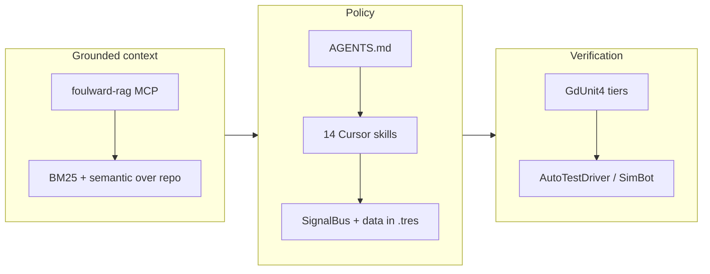

# Foul Ward

Real-time tower defence in **Godot 4.6** (GDScript + C#): you play the monster hunter Florence, the Flower Keeper, as a stationary tower operator, manual aim, hex-grid buildings, campaign progression. This repo is also a **personal proof-of-concept** for AI-augmented engineering: standing orders, retrieval-grounded tooling, multi-tier tests, and headless simulation around the game code.

---

## Engineering story (start here on GitHub)

The default repo view renders this file first. For diagrams, metrics, and file-level references, open:

| Doc | Audience |
|-----|----------|
| **[HOW_IT_WORKS.md](HOW_IT_WORKS.md)** | Full walkthrough: governance (`AGENTS.md`, skills), `foulward-rag` MCP, GdUnit4 runners, SimBot, architecture, gen3d — **includes all Mermaid figures**. |
| **[INTERVIEW_CHEATSHEET.md](INTERVIEW_CHEATSHEET.md)** | One-page pitch, numbers, STAR answers, repo tour. |
| **[AGENTS.md](AGENTS.md)** | Agent standing orders (symlinked as `.cursorrules`). |

High-level scaffold (renders on GitHub like the deeper doc):



**Why not paste all of `HOW_IT_WORKS.md` here?** GitHub best practice is a **short README** plus linked docs: one place for clone/build/quick links, long-form content stays versioned without making every visitor scroll past 1,000+ lines. Mermaid works in **both** `README.md` and `HOW_IT_WORKS.md` on GitHub.

---

## Quick facts

- **665** GdUnit4 test cases (parallel aggregate), **77** `SignalBus` signals, **19** core autoloads — see [HOW_IT_WORKS.md §10](HOW_IT_WORKS.md#10-numbers-at-a-glance) for verification commands.
- **Game design / architecture:** [docs/FOUL_WARD_MASTER_DOC.md](docs/FOUL_WARD_MASTER_DOC.md), [docs/ARCHITECTURE.md](docs/ARCHITECTURE.md).
- **Docs index:** [docs/README.md](docs/README.md), [docs/INDEX_SHORT.md](docs/INDEX_SHORT.md).

---

## Prerequisites

- **Godot 4.6** with .NET (Mono) — project uses C# (`FoulWard.csproj`, `net8.0`).
- **.NET SDK** for `dotnet build` when C# changes.

---

## Build and tests

```bash
dotnet build FoulWard.csproj
./tools/run_gdunit_quick.sh
```

Full parallel suite: `./tools/run_gdunit_parallel.sh`. Sequential baseline: `./tools/run_gdunit.sh`. Details: [HOW_IT_WORKS.md §4](HOW_IT_WORKS.md#4-verification-pipeline), [.cursor/skills/testing/SKILL.md](.cursor/skills/testing/SKILL.md).
