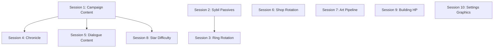

# DELIVERABLE B — Feature Workplan with Perplexity Session Specs

Generated: 2026-04-14 | Auditor: Opus 4.6 (Prompt 1 Plan session)
Updated: 2026-04-14 | Post-batch verification (Prompt 2 session) — corrected file paths, noted batch impacts

### Post-Batch Changes Applied
- **Batch 1**: `dialogue_line_started` / `dialogue_line_finished` moved to SignalBus (no longer local to DialogueManager)
- **Batch 4**: `AllyRole.TANK` removed; `SpellSupport` renumbered to 3. `SimBotLogger` and `TestStrategyProfileConfig` deleted.
- **Batch 5**: `hex_grid.gd` `_try_place_building` split into `_validate_placement()` + `_instantiate_and_place()`
- **Path fix**: `resources/campaigns/campaign_main_50days.tres` corrected to `resources/campaigns/campaign_main_50_days.tres`

---

## Scope

Every non-error work item collected from:
- PLANNED / NOT YET IMPLEMENTED items from master doc
- PLACEHOLDER_ACCEPTABLE resource issues from improvements file
- Open TBD items from master doc §33
- POST-MVP stubs from improvements §6
- 3D art pipeline integration points from `docs/FOUL WARD 3D ART PIPELINE.txt`
- `# TODO(ART)` markers in the codebase (5 files)
- Dialogue placeholder text (15+ entries with "TODO: placeholder dialogue line.")

---

## Session 1: 50-Day Campaign Content Design

**Goal:** Design the complete 50-day campaign: faction assignments for each day, boss placement (mini-boss days, final boss day 50), territory rotation across the five territories, wave composition tuning per day (HP/damage/gold multipliers, spawn count scaling), and starting resources per mission. Currently all 50 DayConfigs have `faction_id = ""` and minimal tuning. This session produces a complete `campaign_main_50days.tres` specification.

**Upload these files to Perplexity:**
- `scripts/resources/day_config.gd`
- `scripts/resources/campaign_config.gd`
- `scripts/resources/faction_data.gd`
- `scripts/resources/boss_data.gd`
- `scripts/resources/territory_data.gd`
- `scripts/resources/territory_map_data.gd`
- `resources/campaigns/campaign_main_50_days.tres` (first 100 lines showing structure)
- `resources/faction_data_default_mixed.tres`
- `resources/faction_data_orc_raiders.tres`
- `resources/faction_data_plague_cult.tres`
- `resources/bossdata_final_boss.tres`
- `resources/bossdata_orc_warlord_miniboss.tres`
- `resources/bossdata_plague_cult_miniboss.tres`
- `resources/territories/main_campaign_territories.tres`

**Include these master doc sections** (copy the section numbers and titles):
- §5 — Types.gd (only the EnemyType table, lines 634–667, and BuildingType table, lines 594–633)
- §12 — Enemies and Bosses (lines 871–895)
- §13 — Campaign and Progression (lines 896–910)
- §20 — Wave System (lines 966–973)

**Trimmed context note:** From §5, include only the EnemyType and BuildingType enum tables (not all enums). From §12, include the boss table and faction table. Total ~120 lines of master doc content.

**Dependencies:** None. This is the foundational content session — Sessions 4, 5, and 8 depend on it.

**Prompt for Perplexity:**
```
You are designing the 50-day campaign for Foul Ward, a Godot 4.4 tower defense game. I am uploading the resource class definitions (DayConfig, CampaignConfig, FactionData, BossData, TerritoryData) and the current campaign/faction/boss .tres files.

CURRENT STATE: The campaign_main_50_days.tres (at resources/campaigns/) has 50 DayConfig sub-resources but all have faction_id = "" (empty string) and minimal tuning values. Three factions exist: DEFAULT_MIXED, ORC_RAIDERS, PLAGUE_CULT. Three bosses exist: plague_cult_miniboss, orc_warlord, final_boss. Five territories exist: heartland_plains, blackwood_forest, ashen_swamp, iron_ridge, outer_city.

DESIGN REQUIREMENTS:
1. Assign faction_id to every day. Days 1-10 should use DEFAULT_MIXED. After day 10, rotate between ORC_RAIDERS and PLAGUE_CULT based on territory. Introduce faction variety so no faction appears more than 5 days in a row.
2. Place mini-boss encounters: at least 2 mini-boss days (one per faction) between days 15-40. Mark these with is_mini_boss_day = true and boss_id matching the .tres files.
3. Day 50 is the final boss (boss_id = "final_boss", is_final_boss = true).
4. Map each day to a territory_id. The campaign should progress through territories roughly in order (heartland_plains early, outer_city late) with some back-and-forth for variety.
5. Design wave tuning multipliers: enemy_hp_multiplier and enemy_damage_multiplier should scale from 1.0 (day 1) to approximately 3.0 (day 50). gold_reward_multiplier should scale from 1.0 to 1.5. spawn_count_multiplier from 1.0 to 2.5.
6. Set base_wave_count: days 1-10 = 3 waves, days 11-30 = 4 waves, days 31-50 = 5 waves.
7. Provide starting_gold values per day (start at 1000, increase to 1500 by day 50).

OUTPUT FORMAT: A table with columns: day_index (1-50), territory_id, faction_id, is_mini_boss_day, boss_id, base_wave_count, enemy_hp_multiplier, enemy_damage_multiplier, gold_reward_multiplier, spawn_count_multiplier, starting_gold. Then provide the exact .tres sub-resource format for 5 sample days (days 1, 10, 25, 40, 50) showing how to encode these values.

Output must be detailed enough that a Cursor agent can implement it in a single session without further questions. Do not suggest alternatives or ask clarifying questions. Make design decisions and justify them briefly.
```

---

## Session 2: Sybil Passive Selection System

**Goal:** Design the Sybil passive selection system: a set of mission-start passive buffs the player chooses from (e.g., +10% mana regen, +15% spell damage, reduced cooldowns). Includes a new GameState `PASSIVE_SELECT`, the selection UI, passive data resources, SpellManager integration, and SignalBus signals. The master doc §33 TBD asks: "Single pick before mission OR all passives always active?" — this session decides.

**Upload these files to Perplexity:**
- `scripts/types.gd` (lines 1–100 covering GameState, DamageType, and existing enum patterns)
- `scripts/spell_manager.gd`
- `autoloads/game_manager.gd` (lines 55–120 covering _ready, state transitions, mission start)
- `autoloads/signal_bus.gd` (lines 1–50 showing signal declaration patterns)
- `scripts/resources/spell_data.gd`

**Include these master doc sections:**
- §2.2 — AI Companions, Sybil subsection (lines 135–141)
- §6 — Game States (lines 779–788)
- §7 — Spells (lines 789–811)
- §27.1 — Full Mission Cycle (lines 1230–1298)
- §31 — Formally Cut Features (lines 1742–1751)
- §33 — Open TBD Items, Sybil row only (line 1791)

**Trimmed context note:** From §27.1, include only the mission start flow (steps 1–2, ~30 lines). Total ~100 lines of master doc content.

**Dependencies:** None. Adds a GameState; must be sequenced before Session 3 (ring rotation) to avoid conflicting state additions.

**Prompt for Perplexity:**
```
You are designing the Sybil Passive Selection system for Foul Ward, a Godot 4.4 tower defense game. Sybil is a spell support companion who manages the SpellManager. I am uploading the current spell system files, GameState enum, game manager state machine, and signal bus patterns.

CURRENT STATE: SpellManager has 4 spells (shockwave, slow_field, arcane_beam, tower_shield) with mana costs, cooldowns, and damage. The GameState enum has 11 values. The mission flow goes MAIN_MENU → MISSION_BRIEFING → COMBAT. There is no passive selection step. Note: AllyRole.TANK was removed in batch 4; SpellSupport is now value 3. dialogue_line_started and dialogue_line_finished signals are now declared on SignalBus (batch 1), not locally in DialogueManager.

DESIGN DECISION (make it, don't ask): Choose "single pick before mission" — the player selects ONE passive from a list of 6-8 options each mission. This creates meaningful choices without overwhelming complexity.

REQUIREMENTS:
1. Define a new resource class SybilPassiveData (extends Resource) with fields: passive_id (String), display_name (String), description (String), icon_id (String), category (String — "offense", "defense", "utility"), effect_type (String), effect_value (float), is_unlocked (bool).
2. Define 8 passives covering offense (spell damage +15%, mana regen +20%), defense (tower shield duration +30%, spell cooldown -15%), and utility (mana cost -10%, spell ready notification, etc.).
3. Add GameState.PASSIVE_SELECT (integer value 11) to the Types.gd enum — append at end, never reorder existing values.
4. Design the state transition: MISSION_BRIEFING → PASSIVE_SELECT → COMBAT. The selection screen shows 3-4 randomly offered passives from the unlocked pool.
5. Define SignalBus signals: sybil_passive_selected(passive_id: String), sybil_passives_offered(passive_ids: Array[String]).
6. Design SpellManager integration: how the selected passive modifies spell behavior (e.g., multiplied mana_regen_rate, modified cooldown values).
7. Design the UI: a simple panel showing 3-4 passive cards with name, description, icon placeholder, and a Select button.
8. Define save/load integration: selected passive persists in save payload under a new "sybil" key.

OUTPUT FORMAT: Complete resource class definition (GDScript), all 8 passive .tres specifications, GameState enum addition, signal declarations, SpellManager modifications (exact method signatures and logic), UI scene structure, and save/load additions. File-by-file changes with exact paths.

Output must be detailed enough that a Cursor agent can implement it in a single session without further questions. Do not suggest alternatives or ask clarifying questions. Make design decisions and justify them briefly.
```

---

## Session 3: Ring Rotation Pre-Battle UI

**Goal:** Design the pre-battle ring rotation screen where players can rotate the HexGrid's three rings before combat begins. The method `HexGrid.rotate_ring(delta_steps: int)` exists but has no UI or caller. This session designs the GameState, UI, and integration.

**Upload these files to Perplexity:**
- `scenes/hex_grid/hex_grid.gd` (lines 1–120 covering slot layout, rotate_ring, ring constants)
- `autoloads/build_phase_manager.gd`
- `autoloads/game_manager.gd` (lines 55–120 covering state transitions)
- `scripts/types.gd` (lines 1–50 covering GameState enum)

**Include these master doc sections:**
- §6 — Game States (lines 779–788)
- §8 — Buildings, Ring Rotation subsection (lines 822–826)
- §25 — Scene Tree Overview (lines 1154–1200)
- §27.1 — Full Mission Cycle, steps 1–3 only (lines 1230–1270)

**Trimmed context note:** From §25, include only the HexGrid and Managers subtree. Total ~80 lines of master doc content.

**Dependencies:** Session 2 (Sybil passives adds PASSIVE_SELECT at value 11; ring rotation should be value 12 to avoid conflicts).

**Prompt for Perplexity:**
```
You are designing the Ring Rotation pre-battle UI for Foul Ward, a Godot 4.4 tower defense game. The HexGrid has 24 slots across 3 concentric rings around the tower. A rotate_ring(delta_steps: int) method already exists but has no UI or callers. I am uploading the HexGrid script, build phase manager, game manager state machine, and GameState enum.

CURRENT STATE: HexGrid has TOTAL_SLOTS = 24 in 3 rings. rotate_ring() shifts buildings within a ring. BuildPhaseManager tracks build phase state. GameState enum ends at PASSIVE_SELECT = 11 (to be added by Session 2). Note: batch 5 extracted _try_place_building into _validate_placement() + _instantiate_and_place() helper methods.

REQUIREMENTS:
1. Add GameState.RING_ROTATE (integer value 12) to Types.gd — append at end.
2. Design the state transition: PASSIVE_SELECT → RING_ROTATE → COMBAT (or skip RING_ROTATE if no buildings are placed yet — first mission).
3. Design the UI: show a top-down hex grid visualization with three rings highlighted. Each ring has left/right rotation arrows. Show building icons in their current slots. Include a "Confirm" button to proceed to COMBAT.
4. The rotation is FREE (no resource cost). Each ring rotates independently.
5. Define the scene structure: res://ui/ring_rotation_screen.tscn + ring_rotation_screen.gd.
6. Integration: GameManager transitions to RING_ROTATE after passive selection (or after MISSION_BRIEFING if passives are not yet implemented). HexGrid.rotate_ring() is called when arrows are clicked.
7. BuildPhaseManager should NOT be active during RING_ROTATE — this is a separate phase.
8. SignalBus signals: ring_rotated(ring_index: int, delta_steps: int).
9. Save: ring positions persist automatically since buildings are already saved by slot index.

OUTPUT FORMAT: GameState enum addition, signal declaration, complete GDScript for ring_rotation_screen.gd (with static typing), scene structure (.tscn node tree), GameManager state transition additions, and integration points. File-by-file changes with exact paths.

Output must be detailed enough that a Cursor agent can implement it in a single session without further questions. Do not suggest alternatives or ask clarifying questions. Make design decisions and justify them briefly.
```

---

## Session 4: Chronicle Meta-Progression System

**Goal:** Design the Chronicle of Foul Ward — a cross-run meta-progression system. The master doc §14 confirms it is designed but not yet implemented. This session produces the complete implementation spec: resources, achievement triggers, perk effects, UI, and save integration.

**Upload these files to Perplexity:**
- `scripts/florence_data.gd`
- `autoloads/signal_bus.gd` (lines 90–150 covering game state, campaign, and build mode signals)
- `autoloads/save_manager.gd` (lines 1–60 covering save payload structure)
- `scripts/types.gd` (lines 1–30 covering enum patterns)

**Include these master doc sections:**
- §14 — Meta-Progression: The Chronicle of Foul Ward (lines 911–918)
- §24 — Signal Bus Reference, Game State + Campaign subsections (lines 1094–1153)
- §28.2 — How to Add a New Signal (lines 1406–1435)
- §33 — Open TBD Items, Chronicle row only (line 1793)

**Trimmed context note:** From §24, include only Game State and Campaign signal tables (~30 lines). Total ~80 lines of master doc content.

**Dependencies:** Session 1 (campaign content provides context for which achievements make sense — e.g., "complete day 25", "defeat orc_warlord mini-boss").

**Prompt for Perplexity:**
```
You are designing the Chronicle meta-progression system for Foul Ward, a Godot 4.4 tower defense game. The Chronicle tracks cross-run achievements and grants permanent minor perks. I am uploading the Florence meta-state resource (tracks run counters), SignalBus signal patterns, SaveManager structure, and the master doc sections.

CURRENT STATE: FlorenceData tracks total_days_played, run_count, boss_attempts, boss_victories, mission_failures, and several boolean unlock flags. SignalBus has signals for mission_won, mission_failed, boss_killed, campaign_completed. SaveManager uses JSON with top-level keys for each system. The Chronicle does NOT exist in code yet.

DESIGN DECISION: Chronicle perks should be cosmetic micro-buffs (not meaningful power advantages). Examples: +2% gold per kill (flavor), +5 starting mana, unique building skins unlocked.

REQUIREMENTS:
1. Define ChronicleData resource class: chronicle_id (String), entries (Array[ChronicleEntryData]), total_xp (int), current_rank (int).
2. Define ChronicleEntryData resource class: entry_id (String), display_name (String), description (String), trigger_signal (String — SignalBus signal name), trigger_condition (Dictionary — e.g., {"count": 10}), reward_type (String — "perk", "cosmetic", "title"), reward_id (String), is_completed (bool).
3. Define ChroniclePerkData resource class: perk_id (String), display_name (String), description (String), effect_type (String), effect_value (float), is_active (bool).
4. Design 15-20 achievements spanning: combat (kill N enemies), campaign (reach day 25, day 50), bosses (defeat each mini-boss), economy (earn N gold total), building (place N buildings), and meta (complete N runs).
5. Design 8-10 perks as rewards: starting gold +50, starting mana +5, sell refund +2%, research cost -5%, etc. All intentionally small.
6. Chronicle persists across runs in a separate save file: user://chronicle.json (not in the per-attempt save slots).
7. Design the UI: accessible from MAIN_MENU as a "Chronicle" button. Shows achievement list with progress bars and perk unlock status.
8. Integration: a new autoload ChronicleManager (or extend FlorenceData) listens to SignalBus signals and tracks achievement progress. Perk effects are applied at mission start via existing manager APIs.
9. Define all SignalBus signal connections and the exact listener pattern.
10. Do NOT implement a full XP/leveling system — just achievement → perk unlocks.

OUTPUT FORMAT: Complete resource class definitions (GDScript), all achievement and perk .tres specifications, ChronicleManager autoload script with full API signatures, UI scene structure, save/load format, SignalBus integration, and init order placement. File-by-file changes with exact paths.

Output must be detailed enough that a Cursor agent can implement it in a single session without further questions. Do not suggest alternatives or ask clarifying questions. Make design decisions and justify them briefly.
```

---

## Session 5: Dialogue Content & Mid-Battle Dialogue

**Goal:** Replace all 15+ placeholder dialogue entries ("TODO: placeholder dialogue line.") with actual character dialogue, and design a mid-battle dialogue trigger system for contextual lines during combat (e.g., "First flying enemy!" or "Tower HP critically low!").

**Upload these files to Perplexity:**
- `autoloads/dialogue_manager.gd` (lines 1–100 covering API, conditions, chain system)
- `scripts/resources/dialogue/dialogue_entry.gd`
- `scripts/resources/dialogue/dialogue_condition.gd`
- `resources/dialogue/companion_melee/arnulf_intro.tres` (sample .tres structure)
- `resources/dialogue/spell_researcher/sybil_intro.tres` (sample .tres structure)
- `resources/character_data/arnulf_hub.tres`
- `resources/character_data/researcher.tres`

**Include these master doc sections:**
- §2.2 — AI Companions (lines 116–141)
- §15 — Hub Screens (lines 919–927)
- §17 — Dialogue System (lines 936–945)
- §3.14 — DialogueManager API (lines 419–438)
- §31 — Formally Cut Features (lines 1742–1751)

**Trimmed context note:** From §2.2, include only Arnulf and Sybil personality summaries (~15 lines). Total ~80 lines of master doc content.

**Dependencies:** Session 1 (campaign content provides day context for contextual dialogue — e.g., which faction appears when, boss encounter days).

**Prompt for Perplexity:**
```
You are writing dialogue content and designing a mid-battle dialogue system for Foul Ward, a Godot 4.4 tower defense game set in a dark humor fantasy world (Warhammer Fantasy meets Terry Pratchett tone). I am uploading the DialogueManager, DialogueEntry/DialogueCondition resource classes, sample .tres files, and character data.

CURRENT STATE: DialogueManager loads DialogueEntry .tres files from res://resources/dialogue/**. Each entry has: entry_id, character_id, text, priority, once_only, chain_next_id, conditions[]. All 15+ entries currently have text = "TODO: placeholder dialogue line." The condition system supports keys like current_mission_number, gold_amount, sybil_research_unlocked_any, arnulf_is_downed, etc.

CHARACTERS:
- COMPANION_MELEE (Arnulf): Burly, hard-drinking warrior with a shovel. Gruff, darkly humorous, loyal but unreliable. References his past drinking (drunkenness system was CUT — do NOT reference active drunkenness mechanics, only as character flavor). Speaks in short, blunt sentences.
- SPELL_RESEARCHER (Sybil): Spell researcher. Scholarly, slightly condescending, obsessed with magical theory. Speaks formally with occasional dry wit.
- MERCHANT: Pragmatic trader. Friendly but always looking for profit. Speaks in merchant idiom.
- WEAPONS_ENGINEER: Tinkerer. Enthusiastic about weapon modifications. Speaks with technical jargon.
- ENCHANTER: Mystical enchantress. Speaks cryptically with poetic flourish.
- MERCENARY_COMMANDER: Battle-hardened captain. No-nonsense military speech.
- FLORENCE: The player character (plague doctor). Rarely speaks; when he does, it's terse and practical.

REQUIREMENTS:

Part A — Hub Dialogue Content:
1. Write 3-5 dialogue entries per character (COMPANION_MELEE, SPELL_RESEARCHER, MERCHANT, WEAPONS_ENGINEER, ENCHANTER, MERCENARY_COMMANDER). Each should be 1-3 sentences.
2. For each character, include:
   - An intro line (priority 100, once_only = true, no conditions)
   - A research-unlocked reaction (conditions: sybil_research_unlocked_any or arnulf_research_unlocked_any)
   - 2-3 generic lines (priority 1, once_only = false) that cycle
   - At least one chain (chain_next_id linking two entries)
3. Use the dark humor fantasy tone consistently. Arnulf should reference fighting, drinking (in past tense), and his shovel. Sybil should reference magical theory and research.

Part B — Mid-Battle Dialogue System:
1. Design a lightweight mid-battle dialogue trigger system. DialogueManager already has signal connections to game events. Add new condition keys:
   - "first_flying_enemy_this_mission" (bool)
   - "tower_hp_below_50_percent" (bool)
   - "wave_number_gte" (int comparison)
   - "enemy_type_first_seen" (String — enemy type name)
2. Mid-battle lines are short (1 sentence max), appear briefly in a toast/banner (not the full DialoguePanel), and do not pause gameplay.
3. Write 8-10 mid-battle lines: first flying enemy warning (Sybil), tower damage alert (Arnulf), wave 3+ encouragement, boss spawn reaction, etc.
4. Define a new DialogueEntry field: is_combat_line (bool, default false). Combat lines use a different UI display path.
5. Design the UI: a small banner at the top of the screen showing character portrait placeholder + text, auto-dismisses after 3 seconds.

OUTPUT FORMAT: Complete .tres content for every dialogue entry (use the exact DialogueEntry resource format from the uploaded files). For mid-battle: new condition keys, DialogueEntry field addition, UI scene structure, DialogueManager additions (method signatures and trigger logic). File-by-file with exact paths.

Output must be detailed enough that a Cursor agent can implement it in a single session without further questions. Do not suggest alternatives or ask clarifying questions. Make design decisions and justify them briefly.
```

---

## Session 6: Shop Rotation & Economy Tuning

**Goal:** Design the shop inventory rotation system (different items available each day) and tune SimBot strategy profile `difficulty_target` values. The master doc §33 TBD asks: "How many items shown per day?" — this session decides.

**Upload these files to Perplexity:**
- `scripts/shop_manager.gd`
- `scripts/resources/shop_item_data.gd`
- `autoloads/economy_manager.gd` (lines 1–50 covering constants and currency fields)
- `resources/shop_data/shop_catalog.tres`
- `resources/strategyprofiles/strategy_balanced_default.tres`
- `resources/strategyprofiles/strategy_greedy_econ.tres`
- `resources/strategyprofiles/strategy_heavy_fire.tres`
- `scripts/resources/strategyprofile.gd`

**Include these master doc sections:**
- §18 — Economy (lines 946–955)
- §19 — Shop (lines 956–965)
- §23 — SimBot and Testing (lines 992–1004)
- §33 — Open TBD Items, Shop rotation row only (line 1794)

**Trimmed context note:** Total ~50 lines of master doc content.

**Dependencies:** None.

**Prompt for Perplexity:**
```
You are designing the shop inventory rotation system and tuning SimBot strategy profiles for Foul Ward, a Godot 4.4 tower defense game. I am uploading the ShopManager, ShopItemData resource class, EconomyManager constants, current shop catalog, and the three SimBot strategy profiles.

CURRENT STATE: ShopManager has 4 items (tower_repair, building_repair, arrow_tower voucher, mana_draught) that are always available. ShopItemData has item_id, display_name, gold_cost, material_cost, description. Three SimBot profiles exist (BALANCED_DEFAULT, GREEDY_ECON, HEAVY_FIRE) with difficulty_target = 0.0 on all three.

DESIGN DECISION: Show 4-6 items per day from a larger pool of 12-15 total items.

REQUIREMENTS:

Part A — Shop Rotation:
1. Design 12-15 ShopItemData entries organized into categories: consumables (instant effects), equipment (persistent buffs for the mission), and vouchers (free building placements).
2. Include the existing 4 items plus: building_material_pack (gain 10 BM), research_boost (gain 3 RM), tower_armor_plate (+50 tower max HP for mission), fire_oil_flask (next 5 projectiles deal bonus fire damage), scout_report (reveal next wave composition), mercenary_discount (reduce next merc cost by 20%), emergency_repair (restore 25% tower HP mid-combat).
3. Design the rotation algorithm: seed with day_index for determinism. Always include at least 1 consumable and 1 equipment. Exclude items the player has already stacked to max (cap 5 per consumable).
4. Add to ShopManager: a get_daily_items(day_index: int) method that returns Array[ShopItemData]. This replaces the static catalog for the between-mission shop tab.
5. Add ShopItemData fields: category (String: "consumable", "equipment", "voucher"), max_stack (int, default 5), rarity_weight (float, default 1.0 — higher = more common in rotation).
6. Provide the complete .tres specification for each new item.

Part B — SimBot Profile Tuning:
1. Set difficulty_target for each profile:
   - BALANCED_DEFAULT: 0.5 (medium)
   - GREEDY_ECON: 0.3 (easy — prioritizes economy over combat)
   - HEAVY_FIRE: 0.7 (hard — aggressive spending on DPS)
2. Provide exact .tres field values for each profile.

OUTPUT FORMAT: ShopItemData field additions, all 12-15 .tres specifications, ShopManager.get_daily_items() implementation (GDScript with static typing), rotation algorithm, profile .tres updates. File-by-file changes with exact paths.

Output must be detailed enough that a Cursor agent can implement it in a single session without further questions. Do not suggest alternatives or ask clarifying questions. Make design decisions and justify them briefly.
```

---

## Session 7: 3D Art Pipeline Integration & Wiring

**Goal:** Finalize the integration between the 3D art pipeline (reference sheet → Rodin → rig → animate → Godot import) and the existing ArtPlaceholderHelper / RiggedVisualWiring code. Standardize AnimationPlayer clip names, document the exact GLB drop zones, and resolve conflicts between the pipeline doc and cut features.

**Upload these files to Perplexity:**
- `scripts/art/art_placeholder_helper.gd`
- `scripts/art/rigged_visual_wiring.gd`
- `FUTURE_3D_MODELS_PLAN.md`
- `docs/FOUL WARD 3D ART PIPELINE.txt`
- `scenes/enemies/enemy_base.gd` (lines 1–50 covering visual slot setup)
- `scenes/arnulf/arnulf.gd` (lines 130–140 covering ArnulfVisual)
- `scenes/bosses/boss_base.gd` (lines 40–50 covering BossVisual)

**Include these master doc sections:**
- §22 — Art Pipeline (lines 984–991)
- §31 — Formally Cut Features (lines 1742–1751)

**Trimmed context note:** Total ~30 lines of master doc content.

**Dependencies:** None.

**CONFLICT FLAG:** The `docs/FOUL WARD 3D ART PIPELINE.txt` line 319 lists `drunk_idle` as a required animation for Arnulf allies. The Arnulf drunkenness system is **FORMALLY CUT** (master doc §31). The pipeline doc must be updated to remove `drunk_idle` from Arnulf's animation list. The Perplexity session should address this.

**Prompt for Perplexity:**
```
You are finalizing the 3D art pipeline integration for Foul Ward, a Godot 4.4 tower defense game. I am uploading the ArtPlaceholderHelper (runtime mesh/material resolver), RiggedVisualWiring (GLB mount + animation), the 3D art pipeline strategy doc, the future 3D models plan, and the relevant scene scripts that consume art assets.

CURRENT STATE:
- ArtPlaceholderHelper resolves meshes by type enum and string ID. Production GLBs at correct paths auto-override placeholders.
- RiggedVisualWiring maps enemy types and allies to GLB paths under res://art/generated/. It mounts GLB scenes into visual slots and drives idle/walk animations via AnimationPlayer.
- The 3D art pipeline doc describes a 5-stage process (reference sheets → Rodin → rigging → animation → Godot import).
- 5 files have # TODO(ART) markers: ally_base.gd:206, arnulf.gd:134, tower.gd:82, boss_base.gd:46, hub.gd:35.

CONFLICT: The pipeline doc lists "drunk_idle (swaying variation) — Arnulf only" as a required animation. The Arnulf drunkenness system is FORMALLY CUT. Remove drunk_idle from the animation requirements.

REQUIREMENTS:
1. Produce a definitive animation clip name table for every entity type:
   - Enemies (all 30 types): idle, walk, attack, hit_react, death, spawn (optional)
   - Allies (Arnulf + mercenaries): idle, run, attack_melee, hit_react, death, downed, recovering
   - Florence/Sybil (Tower): idle, shoot, hit_react, cast_spell, victory, defeat
   - Buildings: idle, active, destroyed
   - Bosses: idle, walk, attack, death, phase_transition (optional)
   Clip names must match EXACTLY what the state machines in EnemyBase, AllyBase, Arnulf, BossBase, Tower, BuildingBase reference.

2. Document the exact GLB drop zone paths for each entity category:
   - res://art/generated/enemies/{enemy_type_lowercase}.glb
   - res://art/generated/allies/{ally_id}.glb
   - res://art/generated/bosses/{boss_id}.glb
   - res://art/generated/buildings/{building_type_lowercase}.glb
   - res://art/characters/{character_name}/{character_name}.glb (for Florence, Arnulf, Sybil)

3. Design a validation script (tools/validate_art_assets.gd) that:
   - Scans all GLB files under res://art/
   - For each, checks that required animation clips exist
   - Reports missing clips, wrong names, or unexpected files
   - Can be run as an EditorScript from Project menu

4. For each TODO(ART) marker, specify what production art replaces:
   - ally_base.gd:206 — GLB from RiggedVisualWiring for ally_id
   - arnulf.gd:134 — res://art/generated/allies/arnulf.glb (ArnulfVisual mount)
   - tower.gd:82 — res://art/characters/florence/florence.glb (Florence visual)
   - boss_base.gd:46 — GLB from RiggedVisualWiring for boss_id
   - hub.gd:35 — 2D character portraits from res://art/icons/characters/

5. Update the 3D art pipeline doc: remove drunk_idle from Arnulf's animation list. Add a note that drunkenness system is formally cut.

OUTPUT FORMAT: Animation clip name table (definitive), GLB path table, validation script GDScript (complete, with static typing), TODO(ART) resolution table, pipeline doc corrections. File-by-file changes with exact paths.

Output must be detailed enough that a Cursor agent can implement it in a single session without further questions. Do not suggest alternatives or ask clarifying questions. Make design decisions and justify them briefly.
```

---

## Session 8: Star Difficulty System

**Goal:** Design the Normal / Veteran / Nightmare difficulty system for per-territory replay. The master doc §13 notes it is on the roadmap but not in code. The master doc §33 TBD asks for exact multipliers.

**Upload these files to Perplexity:**
- `scripts/types.gd` (lines 1–50 covering GameState and enum patterns)
- `scripts/resources/day_config.gd`
- `autoloads/game_manager.gd` (lines 1–60 covering state and constants)
- `autoloads/campaign_manager.gd` (lines 1–60 covering campaign state)
- `scripts/resources/territory_data.gd`

**Include these master doc sections:**
- §13 — Campaign and Progression (lines 896–910)
- §33 — Open TBD Items, Star difficulty row only (line 1796)

**Trimmed context note:** Total ~30 lines of master doc content.

**Dependencies:** Session 1 (campaign content — knowing the base difficulty curve informs what multipliers make sense for Veteran/Nightmare).

**Prompt for Perplexity:**
```
You are designing the Star Difficulty system for Foul Ward, a Godot 4.4 tower defense game. Players can replay territories at higher difficulty tiers after completing the campaign. I am uploading the Types.gd enums, DayConfig resource, GameManager, CampaignManager, and TerritoryData.

CURRENT STATE: The campaign has 50 days across 5 territories. DayConfig has enemy_hp_multiplier, enemy_damage_multiplier, gold_reward_multiplier, spawn_count_multiplier fields. TerritoryData tracks ownership and bonuses. There is no difficulty tier system.

REQUIREMENTS:
1. Add enum Types.DifficultyTier: NORMAL = 0, VETERAN = 1, NIGHTMARE = 2.
2. Define multiplier tables:
   - NORMAL: all 1.0x (base values from DayConfig)
   - VETERAN: enemy_hp 1.5x, enemy_damage 1.3x, gold_reward 1.2x, spawn_count 1.25x
   - NIGHTMARE: enemy_hp 2.5x, enemy_damage 2.0x, gold_reward 1.5x, spawn_count 1.75x
3. Add TerritoryData fields: highest_cleared_tier (Types.DifficultyTier), star_count (int 0-3, one star per tier cleared).
4. Design the selection UI: on the world map, each territory shows 0-3 stars. Clicking a cleared territory offers tier selection. Nightmare requires Veteran cleared first.
5. DayConfig integration: GameManager applies tier multipliers ON TOP of the day's base multipliers when starting a mission. Add a helper: get_effective_multiplier(base: float, tier: Types.DifficultyTier) -> float.
6. Rewards: Veteran completion grants a territory-specific perk (cosmetic or micro-buff). Nightmare grants a title.
7. Save integration: TerritoryData.highest_cleared_tier persists in save payload.
8. SignalBus: territory_tier_cleared(territory_id: String, tier: Types.DifficultyTier).

OUTPUT FORMAT: Enum addition, multiplier table, TerritoryData field additions, GameManager helper methods, world map UI additions, save integration, signal declaration. File-by-file changes with exact paths.

Output must be detailed enough that a Cursor agent can implement it in a single session without further questions. Do not suggest alternatives or ask clarifying questions. Make design decisions and justify them briefly.
```

---

## Session 9: Building HP & Destruction System

**Goal:** Design the building HP and destruction system. Currently buildings are indestructible. The `building_destroyed` signal exists on SignalBus (line 105) but is never emitted. This session adds building HP, damage reception, destruction effects, and the signal activation.

**Upload these files to Perplexity:**
- `scenes/buildings/building_base.gd` (lines 1–80 covering initialization, combat, and key methods)
- `scripts/resources/building_data.gd` (lines 1–60 covering exported fields)
- `scripts/health_component.gd`
- `autoloads/signal_bus.gd` (lines 100–110 covering building signals)
- `scenes/hex_grid/hex_grid.gd` (lines 1–50 covering slot data structure)

**Include these master doc sections:**
- §8 — Buildings (lines 812–826)
- §24 — Signal Bus Reference, Buildings subsection (lines 1077–1085)
- §27.2 — Building Placement Flow (lines 1300–1339)

**Trimmed context note:** Total ~60 lines of master doc content.

**Dependencies:** None.

**Prompt for Perplexity:**
```
You are designing the building HP and destruction system for Foul Ward, a Godot 4.4 tower defense game. Currently buildings are indestructible. I am uploading BuildingBase, BuildingData, HealthComponent, SignalBus building signals, and HexGrid slot management.

CURRENT STATE:
- BuildingBase has no HP. HealthComponent exists but is not attached to buildings.
- BuildingData has no max_hp or durability fields.
- SignalBus.building_destroyed(slot_index: int) is declared but never emitted.
- HexGrid tracks buildings by slot index.
- Enemies have no "attack building" behavior — they path to the tower.

REQUIREMENTS:
1. Add BuildingData fields: max_hp (int, default 0 — 0 means indestructible for backward compat), can_be_targeted_by_enemies (bool, default false).
2. Add a HealthComponent child to BuildingBase when max_hp > 0. Initialize with max_hp from BuildingData.
3. When HealthComponent.health_depleted fires on a building:
   - Emit SignalBus.building_destroyed(slot_index)
   - If summoner: AllyManager.despawn_squad(instance_id)
   - If aura: AuraManager.deregister_aura(instance_id)
   - Play a destruction visual (placeholder: scale to 0 over 0.5s, then queue_free)
   - HexGrid clears the slot
4. Which enemies attack buildings: only enemies with a new EnemyData field prefer_building_targets (bool, default false). When true AND a building with can_be_targeted_by_enemies is in range, the enemy attacks the building instead of pathing to the tower.
5. Set max_hp > 0 on MEDIUM and LARGE buildings only. SMALL buildings remain indestructible. Suggested values: MEDIUM = 200-400 HP, LARGE = 500-800 HP.
6. Repair mechanic: the existing tower_repair shop item repairs the tower. Add building_repair shop item behavior: restores 50% HP to the lowest-HP building.
7. Building HP bar: show a small HP bar above buildings with HP. Use the same visual pattern as enemy HP bars.
8. Save: building HP should persist within a mission but resets between missions (buildings are fresh each day).

OUTPUT FORMAT: BuildingData field additions, EnemyData field additions, BuildingBase modifications (HealthComponent wiring, destruction flow), HexGrid slot clearing on destruction, EnemyBase targeting modification, shop item behavior, HP bar UI, signal emission. File-by-file changes with exact paths and method signatures.

Output must be detailed enough that a Cursor agent can implement it in a single session without further questions. Do not suggest alternatives or ask clarifying questions. Make design decisions and justify them briefly.
```

---

## Session 10: Settings Graphics & Polish

**Goal:** Wire `SettingsManager.set_graphics_quality()` to actual Godot RenderingServer APIs. Currently it stores a string but does not apply any rendering changes.

**Upload these files to Perplexity:**
- `autoloads/settings_manager.gd`
- `scripts/ui/settings_screen.gd`
- `scenes/ui/settings_screen.tscn` (if readable — otherwise describe the node structure)

**Include these master doc sections:**
- §3.8 — SettingsManager API (lines 319–330)

**Trimmed context note:** Total ~15 lines of master doc content.

**Dependencies:** None.

**Prompt for Perplexity:**
```
You are wiring the graphics quality settings for Foul Ward, a Godot 4.4 tower defense game. The SettingsManager stores a quality string but does not apply rendering changes. I am uploading the SettingsManager autoload and SettingsScreen UI script.

CURRENT STATE: SettingsManager.set_graphics_quality(quality: String) stores the string in user://settings.cfg. Quality values are "low", "medium", "high". No RenderingServer or ProjectSettings calls are made. The SettingsScreen has a dropdown for quality selection.

REQUIREMENTS:
1. Define quality presets:
   - "low": shadows off, MSAA disabled, SSAO off, SDFGI off, glow off, motion blur off
   - "medium": shadows on (soft, 2048px), MSAA 2x, SSAO off, glow on
   - "high": shadows on (soft, 4096px), MSAA 4x, SSAO on, glow on, volumetric fog on

2. Implement _apply_quality_preset(quality: String) in SettingsManager that calls:
   - RenderingServer.directional_shadow_atlas_set_size() for shadow resolution
   - Viewport.msaa_3d for MSAA
   - Environment resource modifications for SSAO, glow, volumetric fog
   - get_viewport().set_* calls where applicable

3. Call _apply_quality_preset at startup (load_settings) and whenever set_graphics_quality is called.

4. Add a "Custom" quality option that preserves individual toggle states when the user changes specific settings.

5. SettingsScreen additions: individual toggles for shadows, MSAA, SSAO, glow (visible only when "Custom" quality is selected).

6. Handle the case where the game runs headless (no viewport available) — skip all rendering calls with a guard.

OUTPUT FORMAT: Complete _apply_quality_preset implementation (GDScript with static typing), preset dictionaries, SettingsScreen UI additions, headless guard pattern. File-by-file changes with exact paths.

Output must be detailed enough that a Cursor agent can implement it in a single session without further questions. Do not suggest alternatives or ask clarifying questions. Make design decisions and justify them briefly.
```

---

## Execution Order



### Parallel Track A (Campaign-dependent chain)
1. **Session 1** (50-day campaign content) — START FIRST
2. After Session 1: **Session 4** (Chronicle), **Session 5** (Dialogue), **Session 8** (Star difficulty) can run in parallel

### Parallel Track B (GameState chain)
1. **Session 2** (Sybil passives) — START alongside Session 1
2. After Session 2: **Session 3** (Ring rotation)

### Fully Independent (can run any time)
- **Session 6** (Shop rotation)
- **Session 7** (Art pipeline)
- **Session 9** (Building HP)
- **Session 10** (Settings graphics)

### Recommended Execution Sequence
If running sessions serially (one at a time):
1. Session 1 → Session 2 → Session 6 → Session 7 → Session 9 → Session 10 → Session 3 → Session 4 → Session 5 → Session 8

If running two in parallel:
- Wave 1: Session 1 + Session 2
- Wave 2: Session 6 + Session 7
- Wave 3: Session 9 + Session 10
- Wave 4: Session 3 + Session 4
- Wave 5: Session 5 + Session 8

---

## Appendix: 3D Art Pipeline Conflict

**File:** `docs/FOUL WARD 3D ART PIPELINE.txt`, line 319

**Issue:** Lists `drunk_idle (swaying variation) — Arnulf only` as a required animation.

**Resolution:** The Arnulf drunkenness system is **FORMALLY CUT** (AGENTS.md, master doc §31). The `drunk_idle` animation must be removed from the pipeline requirements. Session 7 addresses this in its Perplexity prompt.

**ArtPlaceholderHelper compatibility:** No code conflict. The helper resolves meshes by file-drop priority — placing a production GLB at the correct path auto-overrides the placeholder. No animation clip name `drunk_idle` is referenced in any GDScript state machine.

---

## Appendix: All Placeholder Resources

| Resource File | Issue | Session |
|---------------|-------|---------|
| `resources/campaigns/campaign_main_50_days.tres` — all 50 DayConfigs `faction_id = ""` | Empty faction assignments | Session 1 |
| `resources/bossdata_*.tres` — `associated_territory_id = ""` | Empty territory links | Session 1 |
| `resources/building_data/*.tres` — `research_damage_boost_id = ""` | Empty research boost IDs | Deferred (research boost system not designed) |
| `resources/character_data/*.tres` — `icon_id = ""` | Empty icon IDs | Session 7 (art pipeline) |
| `resources/strategyprofiles/*.tres` — `difficulty_target = 0.0` | Untuned difficulty targets | Session 6 |
| `resources/dialogue/**/*.tres` — `text = "TODO: placeholder dialogue line."` | Placeholder dialogue | Session 5 |

---

## Appendix: All TODO(ART) Markers

| File | Line | What It Marks |
|------|------|---------------|
| `scenes/allies/ally_base.gd` | 206 | Placeholder visual for ally — replace with GLB |
| `scenes/arnulf/arnulf.gd` | 134 | ArnulfVisual placeholder — replace with production GLB |
| `scenes/tower/tower.gd` | 82 | Tower/Florence visual — replace with production model |
| `scenes/bosses/boss_base.gd` | 46 | BossVisual placeholder — replace with boss GLB |
| `ui/hub.gd` | 35 | Hub character portraits — replace with 2D art |
